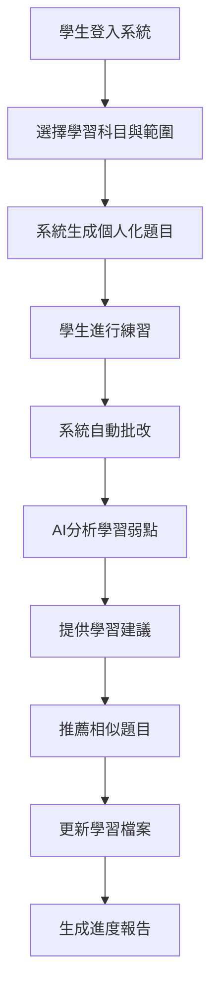
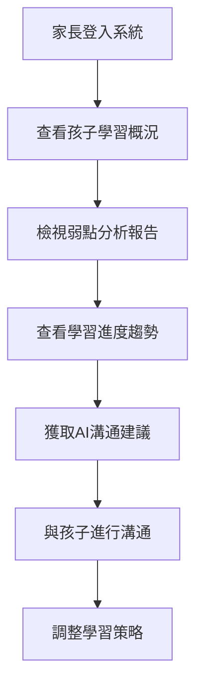
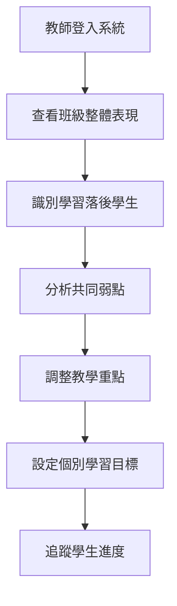

# 業務需求文檔 (Business Requirements Document) - InULearning 個人化學習平台

---

**文件版本 (Document Version):** `v1.0.0`

**最後更新 (Last Updated):** `2024-12-19`

**主要作者 (Lead Author):** `AIPE01_group2`

**審核者 (Reviewers):** `AIPE01_group2 團隊成員、產品經理`

**狀態 (Status):** `草稿 (Draft)`

**相關文檔 (Related Documents):**
*   專案摘要文檔: `../00_project_summary.md`
*   使用者故事清單: `../user_stories/user_stories.md`
*   利害關係人分析: `../stakeholder_analysis/stakeholder_analysis.md`

---

## 目錄 (Table of Contents)

1. [業務背景與目標 (Business Background and Objectives)](#1-業務背景與目標-business-background-and-objectives)
2. [業務需求概述 (Business Requirements Overview)](#2-業務需求概述-business-requirements-overview)
3. [核心業務流程 (Core Business Processes)](#3-核心業務流程-core-business-processes)
4. [業務規則與約束 (Business Rules and Constraints)](#4-業務規則與約束-business-rules-and-constraints)
5. [成功標準與指標 (Success Criteria and Metrics)](#5-成功標準與指標-success-criteria-and-metrics)
6. [風險評估 (Risk Assessment)](#6-風險評估-risk-assessment)
7. [業務假設 (Business Assumptions)](#7-業務假設-business-assumptions)

---

## 1. 業務背景與目標 (Business Background and Objectives)

### 1.1 業務背景 (Business Background)

**問題陳述 (Problem Statement):**
*   **學生學習痛點:** 傳統教育無法兼顧個人差異，學生在遇到挫折時缺乏即時且有效的支援，導致學習興趣低落
*   **家長監督困境:** 由於資訊不對稱，家長無法真正了解孩子的學習狀況，過度關注成績反而使親子關係緊張
*   **教師教學挑戰:** 班級人數眾多，教師難以針對每個學生的學習狀況進行個別指導
*   **市場空缺:** 缺乏能夠自動分析學習弱點、提供精準練習，並串連親子溝通的整合性平台

**商業機會 (Business Opportunity):**
*   個人化學習市場需求持續增長
*   AI 技術在教育領域的應用日趨成熟
*   家長對於學習輔助工具的接受度提高
*   數位原生代學生對於科技學習工具適應能力強

### 1.2 業務目標 (Business Objectives)

#### **主要業務目標 (Primary Business Objectives)**

| 目標ID | 業務目標 | 衡量指標 | 目標值 | 期限 |
|--------|----------|----------|--------|------|
| BO-001 | 建立精準的學習診斷系統 | 診斷準確率 | ≥ 85% | 2025-06-30 |
| BO-002 | 提供個人化學習治療方案 | 學習成效提升 | ≥ 20% | 2025-09-30 |
| BO-003 | 優化親子溝通模式 | 溝通滿意度 | ≥ 4.0/5.0 | 2025-09-30 |
| BO-004 | 支援教師因材施教 | 教師使用率 | ≥ 60% | 2025-12-31 |

#### **次要業務目標 (Secondary Business Objectives)**
*   建立可持續的商業模式
*   提升品牌知名度與市場份額
*   建立用戶社群與生態系統
*   累積教育大數據資產

---

## 2. 業務需求概述 (Business Requirements Overview)

### 2.1 功能性業務需求 (Functional Business Requirements)

#### **BR-001: 智慧學習診斷**
**需求描述:** 系統能夠自動分析學生的學習表現，精準識別學習弱點
**業務價值:** 提升學習效率，減少無效練習時間
**優先級:** 高
**相關使用者故事:** US-002, US-003, US-006

#### **BR-002: 個人化學習推薦**
**需求描述:** 根據學習診斷結果，提供個人化的學習內容和練習題
**業務價值:** 提高學習成效，增強學習動機
**優先級:** 高
**相關使用者故事:** US-004, US-006

#### **BR-003: 學習進度追蹤**
**需求描述:** 完整記錄學習歷程，提供可視化的進度報告
**業務價值:** 幫助學生、家長、教師掌握學習狀況
**優先級:** 高
**相關使用者故事:** US-005, US-007

#### **BR-004: 親子溝通優化**
**需求描述:** 提供AI生成的溝通建議，改善親子互動方式
**業務價值:** 減少親子衝突，提升家庭和諧
**優先級:** 中
**相關使用者故事:** US-008

#### **BR-005: 教師輔助工具**
**需求描述:** 提供班級管理和因材施教的數據支援
**業務價值:** 提升教學效率，實現精準教學
**優先級:** 中
**相關使用者故事:** US-009, US-010

### 2.2 非功能性業務需求 (Non-Functional Business Requirements)

#### **BR-006: 系統可用性**
**需求描述:** 系統需要7x24小時穩定運行，支援隨時學習的需求
**業務價值:** 確保使用者體驗，提升品牌信任度
**衡量標準:** 系統可用性 ≥ 99.9%

#### **BR-007: 響應速度**
**需求描述:** 系統回應速度要快，不影響學習體驗
**業務價值:** 提升使用者滿意度，減少流失率
**衡量標準:** API響應時間 P95 < 500ms

#### **BR-008: 資料安全**
**需求描述:** 保護學生個人資料和學習隱私
**業務價值:** 符合法規要求，建立家長信任
**衡量標準:** 通過資安審核，零重大資料外洩事件

---

## 3. 核心業務流程 (Core Business Processes)

### 3.1 學生學習流程 (Student Learning Process)

### 3.2 家長監控流程 (Parent Monitoring Process)

### 3.3 教師管理流程 (Teacher Management Process)

---

## 4. 業務規則與約束 (Business Rules and Constraints)

### 4.1 業務規則 (Business Rules)

#### **學習相關規則**
*   **BR-R001:** 每次練習最少1題，最多50題
*   **BR-R002:** 練習會話有效期為2小時，超時自動提交
*   **BR-R003:** 相同題目在30天內不會重複出現
*   **BR-R004:** 弱點分析需要至少完成3次練習才能生成

#### **用戶管理規則**
*   **BR-R005:** 每個家長帳戶最多可關聯5個學生
*   **BR-R006:** 學生只能由家長或教師邀請註冊
*   **BR-R007:** 用戶資料保留期為7年，之後可申請刪除

#### **內容管理規則**
*   **BR-R008:** 題目內容需經過專業教師審核
*   **BR-R009:** AI生成的學習建議需要人工抽樣檢核
*   **BR-R010:** 所有學習數據需要匿名化處理

### 4.2 技術約束 (Technical Constraints)

*   **TC-001:** 系統需支援1000+併發用戶
*   **TC-002:** 資料庫查詢響應時間不超過100ms
*   **TC-003:** AI模型推理時間不超過2秒
*   **TC-004:** 前端需支援主流瀏覽器（Chrome, Firefox, Safari, Edge）

### 4.3 法規約束 (Regulatory Constraints)

*   **RC-001:** 符合個人資料保護法規要求
*   **RC-002:** 遵循教育部相關數位學習規範
*   **RC-003:** 符合兒童線上隱私保護法規

---

## 5. 成功標準與指標 (Success Criteria and Metrics)

### 5.1 量化指標 (Quantitative Metrics)

| 類別 | 指標名稱 | 目標值 | 衡量頻率 | 責任人 |
|------|----------|--------|----------|--------|
| **學習成效** | 弱點科目成績提升 | ≥ 20% | 每月 | 產品經理 |
| **用戶滿意度** | 家長溝通滿意度 | ≥ 4.0/5.0 | 每季 | 客戶成功經理 |
| **系統性能** | API響應時間 | P95 < 500ms | 每日 | 技術主管 |
| **業務增長** | 月活躍用戶 | 1000+ | 每月 | 營運經理 |
| **技術指標** | 系統可用性 | ≥ 99.9% | 即時 | DevOps工程師 |

### 5.2 質化指標 (Qualitative Metrics)

*   **用戶體驗:** 界面友善度、學習樂趣提升
*   **教學效果:** 教師反饋、因材施教實現度
*   **親子關係:** 溝通品質改善、衝突減少
*   **品牌形象:** 市場認知度、用戶推薦意願

---

## 6. 風險評估 (Risk Assessment)

### 6.1 高風險項目 (High-Risk Items)

| 風險ID | 風險描述 | 可能性 | 影響程度 | 風險等級 | 緩解策略 |
|--------|----------|--------|----------|----------|----------|
| R-001 | AI模型準確度不達預期 | 中 | 高 | 高 | 多模型驗證、持續優化 |
| R-002 | 用戶接受度低於預期 | 中 | 高 | 高 | 用戶研究、快速迭代 |
| R-003 | 競爭對手推出類似產品 | 高 | 中 | 中 | 差異化定位、專利保護 |
| R-004 | 法規政策變更 | 低 | 高 | 中 | 法務諮詢、合規監控 |

### 6.2 技術風險 (Technical Risks)

*   **系統擴展性限制:** 可能無法支撐大量用戶同時使用
*   **第三方服務依賴:** 外部API服務中斷的風險
*   **資料安全威脅:** 可能面臨資料洩露或駭客攻擊

### 6.3 市場風險 (Market Risks)

*   **需求變化:** 教育政策或學習方式的重大改變
*   **經濟環境:** 經濟不景氣影響家長付費意願
*   **技術變革:** 新技術可能使現有方案過時

---

## 7. 業務假設 (Business Assumptions)

### 7.1 市場假設 (Market Assumptions)

*   **A-001:** 個人化學習需求將持續增長
*   **A-002:** 家長願意為優質學習工具付費
*   **A-003:** 教師接受科技輔助教學的程度提升
*   **A-004:** 學生對數位學習工具適應能力強

### 7.2 技術假設 (Technical Assumptions)

*   **A-005:** AI技術能夠準確分析學習弱點
*   **A-006:** 雲端基礎設施能夠穩定支撐系統運行
*   **A-007:** 第三方API服務保持穩定可靠
*   **A-008:** 開發團隊技術能力足以實現系統目標

### 7.3 營運假設 (Operational Assumptions)

*   **A-009:** 能夠獲得充足的優質題庫內容
*   **A-010:** 專業教師願意參與內容審核工作
*   **A-011:** 客戶服務能夠及時回應用戶需求
*   **A-012:** 營運成本控制在預算範圍內

---

**文件審核記錄 (Review History):**

| 日期 | 審核人 | 版本 | 變更摘要/主要反饋 |
| :--------- | :--------- | :--- | :---------------------------------------------- |
| 2024-12-19 | AIPE01_group2 | v1.0.0 | 業務需求文檔初版，涵蓋完整的業務需求分析 | 