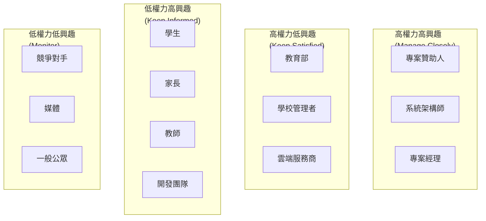

# 利害關係人分析 (Stakeholder Analysis) - InULearning 個人化學習平台

---

**文件版本 (Document Version):** `v1.0.0`

**最後更新 (Last Updated):** `2024-12-19`

**主要作者 (Lead Author):** `AIPE01_group2`

**審核者 (Reviewers):** `AIPE01_group2 團隊成員、專案經理`

**狀態 (Status):** `草稿 (Draft)`

**相關文檔 (Related Documents):**
*   專案摘要文檔: `../00_project_summary.md`
*   業務需求文檔: `../business_requirements/business_requirements.md`
*   使用者故事清單: `../user_stories/user_stories.md`

---

## 目錄 (Table of Contents)

1. [概述 (Overview)](#1-概述-overview)
2. [利害關係人識別 (Stakeholder Identification)](#2-利害關係人識別-stakeholder-identification)
3. [利害關係人分析矩陣 (Stakeholder Analysis Matrix)](#3-利害關係人分析矩陣-stakeholder-analysis-matrix)
4. [主要利害關係人詳細分析 (Key Stakeholder Detailed Analysis)](#4-主要利害關係人詳細分析-key-stakeholder-detailed-analysis)
5. [溝通策略 (Communication Strategy)](#5-溝通策略-communication-strategy)
6. [利害關係人管理計劃 (Stakeholder Management Plan)](#6-利害關係人管理計劃-stakeholder-management-plan)
7. [風險與機會 (Risks and Opportunities)](#7-風險與機會-risks-and-opportunities)

---

## 1. 概述 (Overview)

### 1.1 目的 (Purpose)
識別、分析並管理 InULearning 個人化學習平台專案的所有利害關係人，確保專案成功交付並滿足各方期待。

### 1.2 範圍 (Scope)
本分析涵蓋專案生命週期中所有可能影響或被影響的個人、群體和組織，包括內部團隊、外部用戶、合作夥伴和監管機構。

### 1.3 方法論 (Methodology)
採用權力-興趣分析法 (Power-Interest Analysis) 和影響-態度分析法 (Influence-Attitude Analysis) 進行綜合評估。

---

## 2. 利害關係人識別 (Stakeholder Identification)

### 2.1 內部利害關係人 (Internal Stakeholders)

#### **專案團隊 (Project Team)**
| 角色 | 人員/團隊 | 主要職責 | 參與程度 |
|------|-----------|----------|----------|
| 專案經理 | AIPE01_group2 Tech Lead | 專案整體管理與協調 | 高 |
| 系統架構師 | System Architect | 技術架構設計與決策 | 高 |
| 後端開發工程師 | Backend Team (2-3人) | 後端服務開發與整合 | 高 |
| 前端開發工程師 | Frontend Team (1-2人) | 前端應用開發 | 高 |
| AI/ML 工程師 | AI Engineer | AI 模型開發與優化 | 高 |
| DevOps 工程師 | DevOps Team | 基礎設施與部署 | 中 |
| QA 測試工程師 | QA Team | 品質保證與測試 | 中 |

#### **組織層級 (Organizational Level)**
*   **專案贊助人 (Project Sponsor):** 提供專案資源與支持
*   **技術顧問 (Technical Advisors):** 提供技術指導與審核
*   **法務團隊 (Legal Team):** 確保合規性與智慧財產權保護

### 2.2 外部利害關係人 (External Stakeholders)

#### **主要用戶 (Primary Users)**
*   **學生 (Students):** 7-9年級學生，系統的主要使用者
*   **家長 (Parents):** 學生監護人，關注孩子學習進度
*   **教師 (Teachers):** 班級教師，需要教學輔助工具
*   **學校管理者 (School Administrators):** 教育機構決策者

#### **次要用戶 (Secondary Users)**
*   **教育顧問 (Educational Consultants):** 提供教育專業建議
*   **內容審核者 (Content Reviewers):** 審核題庫內容品質
*   **客戶服務人員 (Customer Service):** 用戶支援服務

### 2.3 外部組織與合作夥伴 (External Organizations & Partners)

#### **技術合作夥伴 (Technical Partners)**
*   **雲端服務提供商:** AWS/Azure/GCP 等基礎設施服務
*   **AI 服務提供商:** Google Gemini API 等第三方 AI 服務
*   **教材出版商:** 南一、翰林、康軒等教材內容提供者

#### **監管與合規 (Regulatory & Compliance)**
*   **教育部:** 數位學習政策制定與監管
*   **個資保護委員會:** 個人資料保護法規監管
*   **消費者保護機構:** 消費者權益保護

---

## 3. 利害關係人分析矩陣 (Stakeholder Analysis Matrix)

### 3.1 權力-興趣矩陣 (Power-Interest Matrix)

### 3.2 影響-態度矩陣 (Influence-Attitude Matrix)

| 利害關係人 | 影響力 | 當前態度 | 期望態度 | 管理策略 |
|------------|--------|----------|----------|----------|
| 學生 | 中 | 積極 | 積極 | 持續參與，收集反饋 |
| 家長 | 高 | 謹慎 | 積極 | 建立信任，展示價值 |
| 教師 | 中 | 中性 | 積極 | 教育訓練，展示效益 |
| 學校管理者 | 高 | 中性 | 支持 | 展示ROI，提供試用 |
| 教育部 | 極高 | 中性 | 支持 | 主動合規，政策配合 |
| 出版商 | 中 | 謹慎 | 合作 | 建立夥伴關係 |

---

## 4. 主要利害關係人詳細分析 (Key Stakeholder Detailed Analysis)

### 4.1 學生 (Students)

**基本特徵:**
*   年齡：12-15歲 (7-9年級)
*   科技接受度：高
*   學習壓力：中等至高
*   時間可用性：有限 (課業繁重)

**需求與期望:**
*   簡單易用的學習界面
*   即時的學習反饋
*   有趣且有效的學習體驗
*   個人化的學習內容
*   進步可見的成就感

**關注點與顧慮:**
*   系統會否增加學習負擔
*   隱私資料是否安全
*   是否真正有助於學習
*   操作是否簡單直觀

**參與策略:**
*   邀請參與 UI/UX 設計測試
*   定期收集使用體驗反饋
*   建立學生用戶社群
*   提供學習成果展示平台

### 4.2 家長 (Parents)

**基本特徵:**
*   年齡：35-50歲
*   教育程度：中等至高
*   科技接受度：中等
*   經濟負擔考量：高

**需求與期望:**
*   了解孩子真實學習狀況
*   獲得具體的輔導建議
*   改善親子溝通關係
*   看到明確的學習成效
*   合理的使用成本

**關注點與顧慮:**
*   孩子的資料隱私安全
*   系統是否真正有效
*   費用是否合理
*   會否增加親子衝突
*   操作是否複雜

**參與策略:**
*   提供詳細的功能說明
*   展示成功案例與數據
*   建立家長交流社群
*   定期舉辦親子教育講座

### 4.3 教師 (Teachers)

**基本特徵:**
*   教學經驗：5-20年
*   科技接受度：中等
*   工作負荷：高
*   創新意願：中等

**需求與期望:**
*   減輕教學負擔
*   獲得學生學習數據洞察
*   提升教學效果
*   支援因材施教
*   簡單的操作流程

**關注點與顧慮:**
*   是否會取代教師角色
*   學習曲線是否陡峭
*   資料分析是否準確
*   是否增加工作負擔

**參與策略:**
*   提供完整的培訓課程
*   展示教學輔助價值
*   建立教師使用社群
*   收集教學改進建議

### 4.4 學校管理者 (School Administrators)

**基本特徵:**
*   決策權力：高
*   預算考量：高
*   績效壓力：高
*   創新接受度：中等

**需求與期望:**
*   提升學校整體教學品質
*   降低教育成本
*   獲得競爭優勢
*   符合教育政策方向
*   明確的投資回報

**關注點與顧慮:**
*   實施成本與效益
*   師生接受度
*   技術維護複雜度
*   政策合規性

**參與策略:**
*   提供詳細的ROI分析
*   安排試點實施計劃
*   展示成功學校案例
*   提供完整的支援服務

---

## 5. 溝通策略 (Communication Strategy)

### 5.1 溝通矩陣 (Communication Matrix)

| 利害關係人群體 | 溝通頻率 | 溝通方式 | 主要訊息 | 負責人 |
|----------------|----------|----------|----------|--------|
| 專案團隊 | 每日 | 站立會議、Slack | 進度更新、技術討論 | 專案經理 |
| 學生用戶 | 每週 | App通知、社群 | 功能更新、學習鼓勵 | 產品經理 |
| 家長用戶 | 每月 | 電郵、報告 | 孩子進度、使用指南 | 客戶成功 |
| 教師用戶 | 每月 | 研習會、電郵 | 功能教學、案例分享 | 教育顧問 |
| 學校管理者 | 每季 | 會議、報告 | 效益展示、政策更新 | 業務經理 |
| 監管機構 | 按需 | 正式文件 | 合規報告、政策配合 | 法務經理 |

### 5.2 關鍵訊息框架 (Key Messaging Framework)

#### **核心價值主張 (Core Value Proposition)**
*   **對學生:** "讓學習更智慧、更有趣、更有效"
*   **對家長:** "深度了解孩子，科學陪伴成長"
*   **對教師:** "數據驅動教學，實現因材施教"
*   **對學校:** "提升教學品質，創造競爭優勢"

#### **差異化優勢 (Differentiation)**
*   AI 驅動的精準診斷
*   個人化學習路徑
*   親子溝通優化
*   完整的學習生態系

---

## 6. 利害關係人管理計劃 (Stakeholder Management Plan)

### 6.1 參與策略 (Engagement Strategies)

#### **高優先級利害關係人**

**1. 學生與家長**
*   **策略:** 用戶中心設計，持續收集反饋
*   **活動:** 用戶訪談、問卷調查、焦點小組
*   **時程:** 每月一次深度訪談，每週線上反饋收集
*   **預期成果:** 高用戶滿意度，低流失率

**2. 教師**
*   **策略:** 教育訓練，成效展示
*   **活動:** 工作坊、案例研討、同儕分享
*   **時程:** 季度工作坊，月度案例分享
*   **預期成果:** 教師積極使用，推薦給同事

**3. 學校管理者**
*   **策略:** 數據驅動說服，試點驗證
*   **活動:** 效益簡報、試點計劃、成果展示
*   **時程:** 季度效益報告，半年試點評估
*   **預期成果:** 學校正式採購，長期合作

### 6.2 阻力管理 (Resistance Management)

#### **潛在阻力來源**
*   **教師:** 擔心被科技取代
*   **家長:** 對新技術的疑慮
*   **學生:** 增加學習負擔的擔憂

#### **阻力緩解策略**
*   透明溝通，解釋系統定位為"輔助"而非"取代"
*   提供充分的培訓與支援
*   展示成功案例與數據證據
*   建立意見反饋與改進機制

---

## 7. 風險與機會 (Risks and Opportunities)

### 7.1 利害關係人相關風險 (Stakeholder-Related Risks)

| 風險 | 可能性 | 影響程度 | 緩解策略 |
|------|--------|----------|----------|
| 家長對隱私安全的擔憂 | 中 | 高 | 透明的隱私政策，第三方安全認證 |
| 教師接受度不高 | 中 | 中 | 加強培訓，展示教學效益 |
| 學校預算限制 | 高 | 中 | 彈性付費方案，ROI證明 |
| 監管政策變更 | 低 | 高 | 主動合規，政策追蹤 |

### 7.2 利害關係人帶來的機會 (Stakeholder-Driven Opportunities)

*   **教師社群:** 可成為產品推廣的重要管道
*   **家長網絡:** 口碑傳播的強大力量
*   **學校合作:** 可提供真實使用場景與數據
*   **政府支持:** 可能獲得政策支持或補助

### 7.3 監控與調整機制 (Monitoring and Adjustment)

#### **利害關係人滿意度追蹤**
*   月度用戶滿意度調查
*   季度利害關係人態度評估
*   年度利害關係人分析更新

#### **策略調整觸發條件**
*   滿意度分數低於75%
*   關鍵利害關係人態度轉為負面
*   外部環境發生重大變化

---

**文件審核記錄 (Review History):**

| 日期 | 審核人 | 版本 | 變更摘要/主要反饋 |
| :--------- | :--------- | :--- | :---------------------------------------------- |
| 2024-12-19 | AIPE01_group2 | v1.0.0 | 利害關係人分析文檔初版，涵蓋完整的利害關係人識別與管理策略 | 