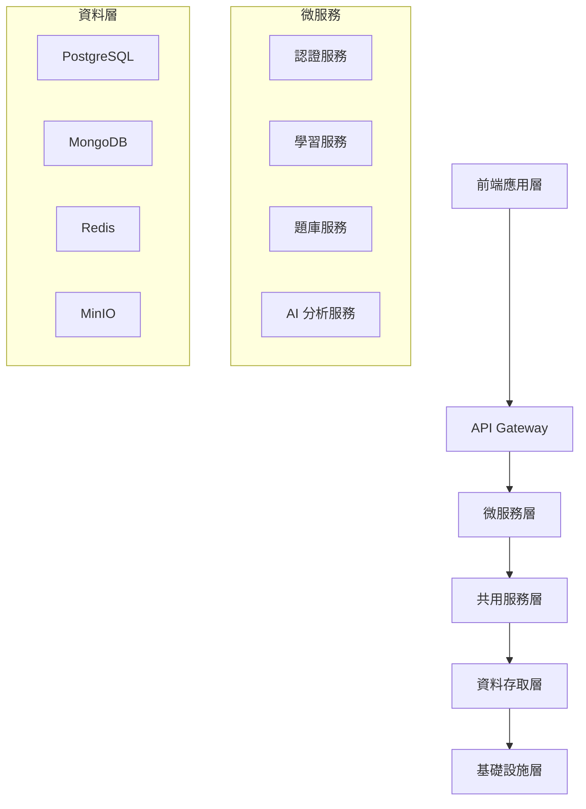

# 檔案相依關係文檔 (File Dependencies Document) - InULearning 個人化學習平台

---

**文件版本 (Document Version):** `v1.0.0`

**最後更新 (Last Updated):** `2024-12-19`

**主要作者 (Lead Author):** `AIPE01_group2`

**審核者 (Reviewers):** `AIPE01_group2 團隊成員、系統架構師`

**狀態 (Status):** `草稿 (Draft)`

**相關設計文檔 (Related Documents):**
*   系統架構文檔: `02_system_architecture_document.md`
*   系統設計文檔: `03_system_design_document.md`
*   API 設計文檔: `04_api_design.md`
*   專案結構文檔: `07_project_structure.md`

---

## 目錄 (Table of Contents)

1.  [概述 (Overview)](#1-概述-overview)
2.  [整體架構依賴關係 (Overall Architecture Dependencies)](#2-整體架構依賴關係-overall-architecture-dependencies)
3.  [層級結構分析 (Layer Structure Analysis)](#3-層級結構分析-layer-structure-analysis)
4.  [具體 Import 關係 (Specific Import Relationships)](#4-具體-import-關係-specific-import-relationships)
5.  [循環依賴檢查 (Circular Dependency Check)](#5-循環依賴檢查-circular-dependency-check)
6.  [部署依賴順序 (Deployment Dependency Order)](#6-部署依賴順序-deployment-dependency-order)

---

## 1. 概述 (Overview)

### 1.1 依賴關係圖表


---

## 2. 整體架構依賴關係 (Overall Architecture Dependencies)

### 2.1 服務間依賴關係
- **認證服務** ← 所有其他服務 (身份驗證)
- **學習服務** ← AI 分析服務、題庫服務
- **題庫服務** ← 學習服務、AI 分析服務
- **通知服務** ← 學習服務、認證服務

### 2.2 資料庫依賴關係
- **PostgreSQL**: 用戶數據、學習記錄
- **MongoDB**: 題庫資料、練習內容
- **Redis**: 快取、會話管理
- **MinIO**: 檔案存儲、多媒體資源

---

## 3. 層級結構分析 (Layer Structure Analysis)

### 3.1 分層架構依賴
```
Presentation Layer (前端)
    ↓
API Gateway Layer (閘道層)
    ↓
Business Logic Layer (業務邏輯層)
    ↓
Data Access Layer (資料存取層)
    ↓
Infrastructure Layer (基礎設施層)
```

### 3.2 依賴原則
- **向下依賴**: 上層可以依賴下層，下層不可依賴上層
- **介面隔離**: 透過介面進行依賴，降低耦合度
- **依賴注入**: 使用依賴注入管理服務間關係

---

## 4. 具體 Import 關係 (Specific Import Relationships)

### 4.1 Python 模組依賴
```python
# 示例：學習服務的依賴關係
from backend.shared.database import DatabaseConfig
from backend.shared.schemas import BaseModel
from backend.auth_service.models import User
from backend.question_bank_service.client import QuestionBankClient
```

### 4.2 前端模組依賴
```javascript
// 示例：前端模組依賴
import { ApiClient } from '../shared/utils/api-client.js';
import { AuthService } from '../shared/services/auth.service.js';
import { LearningService } from './services/learning.service.js';
```

---

## 5. 循環依賴檢查 (Circular Dependency Check)

### 5.1 已識別的循環依賴風險
- ❌ **學習服務 ↔ AI 分析服務**: 避免直接相互調用
- ❌ **用戶服務 ↔ 通知服務**: 使用事件機制解耦

### 5.2 解決方案
- 使用事件驅動架構 (Event-Driven Architecture)
- 引入中介服務或 Message Queue
- 採用接口隔離原則

---

## 6. 部署依賴順序 (Deployment Dependency Order)

### 6.1 服務啟動順序
```
1. 基礎設施服務 (PostgreSQL, MongoDB, Redis, MinIO)
2. 共用服務 (Shared utilities, Database connections)
3. 核心服務 (認證服務)
4. 業務服務 (學習服務, 題庫服務, AI 分析服務)
5. 輔助服務 (通知服務, 報表服務)
6. API Gateway (Nginx)
7. 前端應用
```

### 6.2 健康檢查依賴
每個服務都需要檢查其依賴服務的健康狀態：
- 資料庫連接檢查
- 外部 API 可用性檢查
- 必要配置文件存在性檢查

---

**文件審核記錄 (Review History):**

| 日期 | 審核人 | 版本 | 變更摘要/主要反饋 |
| :--------- | :--------- | :--- | :---------------------------------------------- |
| 2024-12-19 | AIPE01_group2 | v1.0.0 | 檔案依賴關係文檔初版，涵蓋主要依賴關係分析 | 