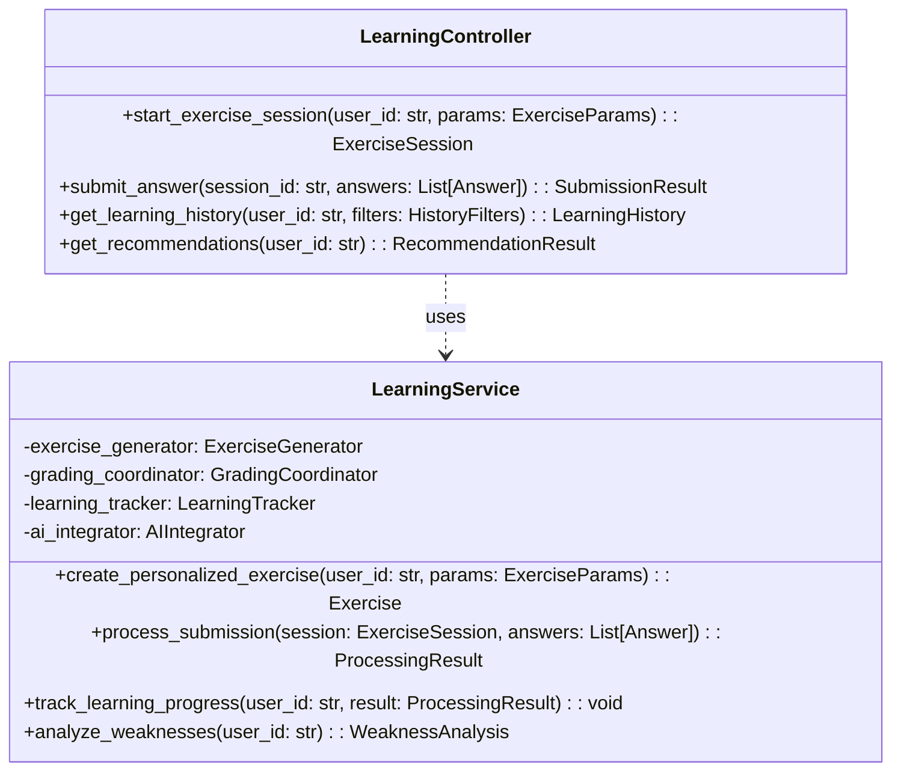

# 系統詳細設計文檔 (System Design Document) - InULearning 學習服務模組

---

**文件版本 (Document Version):** `v0.3`

**最後更新 (Last Updated):** `2024-12-19`

**主要作者/設計師 (Lead Author/Designer):** `AIPE01_group2`

**審核者 (Reviewers):** `AIPE01_group2 團隊成員`

**狀態 (Status):** `草稿 (Draft)`

**相關系統架構文檔 (SA Document):** `02_system_architecture_document.md`

**相關 User Stories/Features:** `US-002 (智慧出題系統), US-003 (自動批改功能), US-004 (相似題練習), US-005 (學習歷程記錄), US-006 (AI 智慧化升級)`

**相關 ADRs (若適用):** `ADR-001 (技術選型), ADR-002 (架構模式), ADR-003 (資料庫設計)`

---

## 目錄 (Table of Contents)

1.  [引言 (Introduction)](#1-引言-introduction)
2.  [模組/功能概述 (Module/Feature Overview)](#2-模組功能概述-modulefeature-overview)
3.  [詳細設計 (Detailed Design)](#3-詳細設計-detailed-design)
4.  [設計考量 (Design Considerations)](#4-設計考量-design-considerations)
5.  [介面定義 (Interface Definitions)](#5-介面定義-interface-definitions)
6.  [未來展望 (Future Considerations)](#6-未來展望-future-considerations)
7.  [附錄 (Appendices)](#7-附錄-appendices)

---

## 1. 引言 (Introduction)

### 1.1 目的 (Purpose)
為 InULearning 個人化學習平台的核心學習服務模組提供詳細的技術實現規格和設計細節，指導開發團隊進行程式碼實作、單元測試和系統整合工作。本設計採用前後端分離架構，確保前端專注於用戶體驗，後端專注於業務邏輯和數據處理。

### 1.2 範圍 (Scope)
本文件涵蓋學習服務模組的完整設計，包括智慧出題、自動批改、學習歷程追蹤、AI 分析整合等核心功能，但不包括前端 UI 設計和其他服務模組的詳細實現。

---

## 2. 模組/功能概述 (Module/Feature Overview)

### 2.1 功能描述 (Functional Description)
學習服務模組是 InULearning 平台的核心業務邏輯中心，負責：

*   **個人化出題管理：** 根據學生年級（7A-9B）、版本（南一/翰林/康軒）、科目（國文/英文/數學/自然/地理/歷史/公民）、章節、難度（易/中/難）需求，結合學習歷史生成個人化練習題
*   **題庫練習管理：** 管理學生的完整學習會話，從開始練習到提交答案的全流程
*   **自動批改協調：** 協調自動批改服務對學生答案進行即時評分和分析
*   **學習歷程追蹤：** 完整記錄學生的學習行為、練習結果、進度變化，建立長期學習歷史
*   **AI 分析整合：** 整合 AI 服務進行弱點分析和相似題推薦，提供個人化學習建議

---

## 3. 詳細設計 (Detailed Design)

### 3.1 模組結構與組件設計 (Module Structure and Component Design)

#### 3.1.1 類別圖/組件圖 (Class/Component Diagrams)



---

## 4. 設計考量 (Design Considerations)

### 4.1 架構設計理念 (Architecture Design Philosophy)
*   **前後端分離:** 採用完全前後端分離的架構設計，前端負責展示層和用戶交互，後端提供 RESTful API 服務
*   **API 優先設計:** 所有功能都通過標準化的 HTTP API 提供，確保前端可以獨立開發和部署

### 4.2 安全性 (Security)
*   **輸入驗證:** 所有 API 輸入參數使用 Pydantic 模型進行嚴格驗證
*   **權限控制:** 學生只能存取自己的學習數據，家長可查看關聯學生數據

---

## 5. 介面定義 (Interface Definitions)

### 5.1 API 設計 (API Design)

#### 5.1.1 外部 API (External/Public APIs)

*   **端點:** `POST /api/v1/learning/exercises`
*   **描述:** 開始新的個人化練習會話
*   **請求:**
    *   **Headers:** `Authorization: Bearer <JWT_TOKEN>`
    *   **請求體:**
        ```json
        {
          "grade": "8A",
          "subject": "數學",
          "publisher": "南一",
          "chapter": "1-1 一元一次方程式",
          "question_count": 10,
          "difficulty": "normal"
        }
        ```

---

## 6. 未來展望 (Future Considerations)

*   **機器學習模型整合:** 開發專屬的學習分析模型，提升推薦準確性
*   **實時協作學習:** 支持多人同時練習和討論功能

---

## 7. 附錄 (Appendices)

### 7.1 API 錯誤碼對照表

| 錯誤碼 | HTTP 狀態碼 | 描述 |
| :--- | :--- | :--- |
| `LEARNING_001` | 400 | 無效的練習參數 |
| `LEARNING_002` | 401 | 用戶未認證 |

---

**文件審核記錄 (Review History):**

| 日期 | 審核人 | 版本 | 變更摘要/主要反饋 |
| :--------- | :--------- | :--- | :---------------------------------------------- |
| 2024-12-19 | AIPE01_group2 | v0.3 | 文檔複製至專案，包含學習服務模組詳細設計 | 