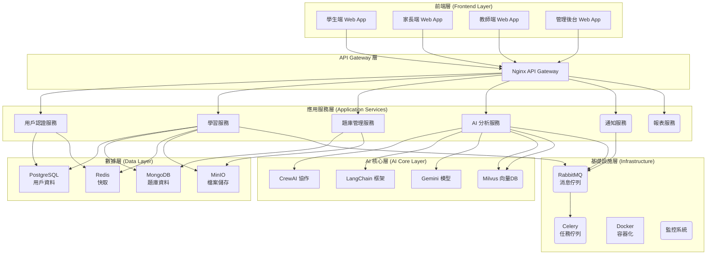
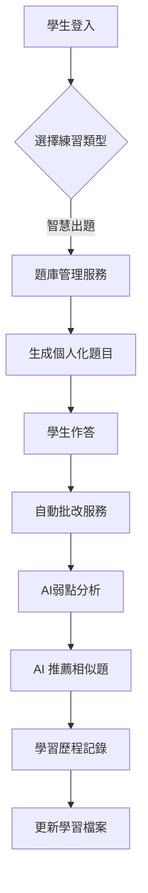
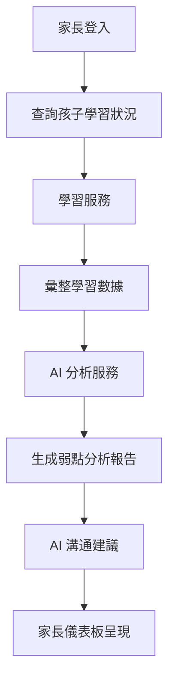
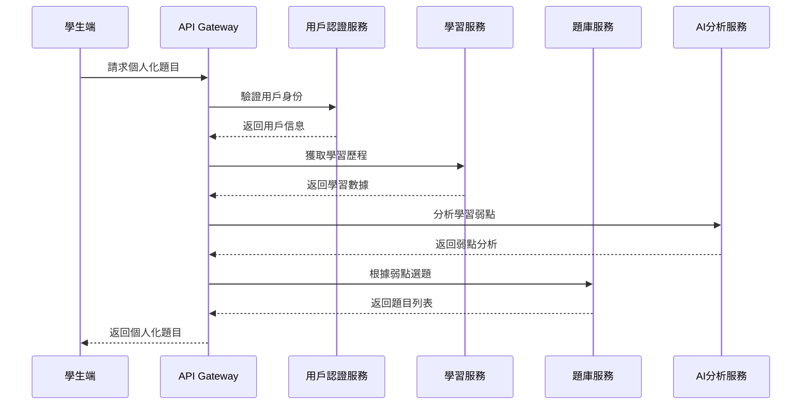

# 系統架構設計文檔 (System Architecture Document) - InULearning 個人化學習平台

---

**文件版本 (Document Version):** `v1.0`

**最後更新 (Last Updated):** `2025-08-15`

**主要作者/架構師 (Lead Author/Architect):** `AIPE01_group2`

**審核者 (Reviewers):** `AIPE01_group2 團隊成員`

**狀態 (Status):** `核心功能已實現 (Core Functionality Implemented)`

**相關 PRD/專案簡報:** `[00_project_summary.md]`

**相關 ADRs:** `ADR-001 (技術選型), ADR-002 (架構模式), ADR-003 (資料庫設計)`

---

## 目錄 (Table of Contents)

1.  [引言 (Introduction)](#1-引言-introduction)
2.  [架構概述與目標 (Architecture Overview and Goals)](#2-架構概述與目標-architecture-overview-and-goals)
3.  [需求回顧 (Requirements Revisited - FANG Style PRD Alignment)](#3-需求回顧-requirements-revisited---fang-style-prd-alignment)
4.  [高層次架構設計 (High-Level Architectural Design)](#4-高層次架構設計-high-level-architectural-design)
5.  [技術選型詳述 (Technology Stack Details)](#5-技術選型詳述-technology-stack-details)
6.  [可行性分析概要 (Feasibility Analysis Summary - FANG Style 6-Pager Concept)](#6-可行性分析概要-feasibility-analysis-summary---fang-style-6-pager-concept)
7.  [Production Readiness Checklist (PRC) - 初步考量](#7-production-readiness-checklist-prc---初步考量)
8.  [未來展望與演進方向 (Future Considerations and Evolution)](#8-未來展望與演進方向-future-considerations-and-evolution)
9.  [附錄 (Appendices - 選填)](#9-附錄-appendices---選填)

---

## 1. 引言 (Introduction)

### 1.1 目的與範圍 (Purpose and Scope)
*   **目的 (Purpose):** 為 InULearning 個人化學習平台提供一個清晰、一致的高層次架構藍圖，指導後續的詳細設計和開發實施，確保系統能夠滿足精準診斷、個人化治療、數據化追蹤及優化親子溝通的核心目標。
*   **範圍 (Scope):** 本架構文檔涵蓋學生學習系統、家長監控系統、教師管理系統的完整技術架構，包括前端使用者介面、後端 API 服務、AI 智慧核心、資料存儲方案、及系統整合方案。不包括具體的 UI/UX 設計細節和商業運營策略。

### 1.2 目標讀者 (Target Audience)
*   AIPE01_group2 專案開發團隊成員
*   系統架構師與技術負責人
*   前端與後端開發工程師
*   AI/ML 工程師
*   數據工程師
*   測試與 QA 工程師
*   DevOps 與運維團隊

### 1.3 術語表 (Glossary)

| 術語/縮寫 | 完整名稱/解釋 |
| :------- | :----------- |
| RAG | Retrieval-Augmented Generation - 檢索增強生成 |
| MLOps | Machine Learning Operations - 機器學習運維 |
| MVP | Minimum Viable Product - 最小可行產品 |
| API | Application Programming Interface - 應用程式介面 |
| JWT | JSON Web Token - JSON 網路令牌 |
| ETL | Extract, Transform, Load - 提取、轉換、載入 |

### 1.4 參考文件 (References)
*   PRD/專案簡報: 00_project_summary.md
*   InULearning 專案提案報告: project_point.md
*   開發指引: .cursorrules
*   期末專題簡報材料: AIPE01_group2_期末專題_簡報PIC

---

## 2. 架構概述與目標 (Architecture Overview and Goals)

### 2.1 系統願景與核心價值 (System Vision and Core Values)
打造一個高效、精準、溫暖的個人化學習生態系，透過 AI 驅動的智慧分析，解決傳統教學模式的痛點，實現精準診斷學習弱點、提供個人化學習治療方案、完整記錄學習歷程，有效提升學生學習成效。

### 2.2 架構目標與原則 (Architectural Goals and Principles)
*   **架構目標 (Goals):**
    *   *高可用性：* 系統可用性達到 99.9% 以上，支持 7x24 小時穩定服務
    *   *高效能：* API 響應時間 P95 < 500ms，支援 1000+ 併發用戶同時使用
    *   *可擴展性：* 支持橫向擴展，能適應 3 年內 10 倍用戶增長
    *   *AI 準確性：* 學習弱點診斷準確度 > 85%，相似題推薦相關度 > 80%
    *   *數據安全：* 符合個人資料保護規範，實現端到端加密
*   **設計原則 (Principles):**
    *   *微服務架構：* 採用松耦合的微服務設計，提升可維護性
    *   *API 優先：* 所有功能通過 RESTful API 提供，支持多端接入
    *   *事件驅動：* 關鍵業務流程採用事件驅動架構，提升系統響應性
    *   *領域驅動設計：* 按業務領域劃分服務邊界
    *   *雲原生：* 採用容器化部署，支持彈性伸縮

### 2.3 主要制約因素與假設 (Key Constraints and Assumptions)
*   **制約因素 (Constraints):**
    *   開發時程限制：需在 10 個月內完成兩階段 MVP 開發
    *   團隊技能：團隊對 AI/ML 技術棧需要學習週期
    *   預算限制：雲端服務成本需要控制在合理範圍
    *   合規性：需符合教育資料保護相關法規
*   **假設 (Assumptions):**
    *   用戶主要使用現代瀏覽器和行動裝置
    *   穩定的網路連接環境
    *   AI 模型訓練資料品質良好且足夠
    *   題庫資料可以通過合作夥伴或自建方式獲得

---

## 3. 需求回顧 (Requirements Revisited - FANG Style PRD Alignment)

### 3.1 功能性需求摘要 (Functional Requirements Summary)
*   **用戶管理系統：** 支持學生、家長、老師三種角色的註冊、登入、權限管理 (對應 US-001)
*   **智慧出題引擎：** 根據年級、版本、科目、章節、題數需求自動生成個人化練習題 (對應 US-002)
*   **自動批改系統：** 即時批改學生答案，提供詳細的分析報告 (對應 US-003)
*   **AI 推薦系統：** 基於錯誤分析，推薦相似題型進行強化練習 (對應 US-004, US-006)
*   **學習歷程追蹤：** 完整記錄學習行為，建立個人學習檔案 (對應 US-005)
*   **家長儀表板：** 視覺化呈現學習弱點分析，提供 AI 溝通建議 (對應 US-007, US-008)
*   **教師管理平台：** 班級整體學習狀況管理，支持因材施教 (對應 US-009)

### 3.2 非功能性需求 (Non-Functional Requirements - NFRs)

| NFR 分類 | 具體需求描述 | 衡量指標/目標值 |
| :--------------- | :--------------------------------------------------------------------------- | :---------------------------------------- |
| **性能 (Performance)** | API 端點平均響應時間 | < 500ms (P95) |
| | 系統吞吐量 | 1000+ 併發用戶 |
| | AI 模型推理時間 | < 2 秒 |
| **可擴展性 (Scalability)** | 支持用戶增長 | 3 年內支援 10 倍用戶增長 |
| | 服務橫向擴展 | 支持無縫水平擴展 |
| **可用性 (Availability)** | 系統年可用性 | 99.9% (SLA) |
| | 服務恢復時間 | RTO < 4 小時 |
| **可靠性 (Reliability)** | 數據備份恢復 | RPO < 1 小時 |
| | 錯誤率 | < 0.1% |
| **安全性 (Security)** | 數據傳輸加密 | TLS 1.3+ |
| | 身份驗證機制 | JWT + OAuth 2.0 |
| | 個資保護 | 符合 GDPR/個資法 |
| **可維護性 (Maintainability)** | 代碼覆蓋率 | > 80% |
| | 新功能開發週期 | < 2 週 |
| **可觀測性 (Observability)** | 監控覆蓋率 | 100% 核心服務 |
| | 告警響應時間 | < 5 分鐘 |

---

## 4. 高層次架構設計 (High-Level Architectural Design)

### 4.1 選定的架構模式 (Chosen Architectural Pattern)
採用 **微服務架構 (Microservices Architecture)** 結合 **事件驅動架構 (Event-Driven Architecture)**
*   **選擇理由：** 微服務架構支持團隊獨立開發和部署，提升開發效率；事件驅動架構實現服務間松耦合，提升系統彈性和可擴展性。適合多角色、多功能的複雜教育平台。

### 4.2 系統組件圖 (System Component Diagram)

> **圖例:** `[...]` 方形邊框代表 **已實現** 的組件，`(...)` 圓角邊框代表 **規劃中** 的組件。

### 4.3 主要組件/服務及其職責 (Key Components/Services and Responsibilities)

| 組件/服務名稱 | 核心職責 | 主要技術/框架 | 預期 Owner | 依賴的其他組件/服務 | 狀態 | 初步SLA/SLO | 備註/設計考量 |
| :-------------------- | :-------------------------------------------------------- | :------------------- | :--------------------- | :-------------------- | :--- | :----------------- | :------------------- |
| 用戶認證服務 | 處理三種角色的註冊、登入、權限管理和 Token 驗證 | FastAPI, JWT, OAuth 2.0 | 後端團隊 | PostgreSQL, Redis | ✅ 已實現 | 99.95% 可用性 | 需支持角色切換 |
| 學習服務 | 管理學習歷程、練習記錄、進度追蹤 | FastAPI, SQLAlchemy | 後端團隊 | PostgreSQL, MongoDB, AI分析服務 | ✅ 已實現 | 99.9% 可用性 | 核心業務邏輯 |
| 題庫管理服務 | 題目 CRUD、分類管理、版本控制 | FastAPI, MongoDB | 後端團隊 | MongoDB, MinIO | ✅ 已實現 | 99.9% 可用性 | 需支持大量題目存儲 |
| AI 分析服務 | 學習弱點分析、相似題推薦、個人化建議生成 | FastAPI, CrewAI, LangChain, Gemini | AI 團隊 | Milvus, MongoDB, Gemini API | ✅ 已實現 | 99.5% 可用性 | AI 模型準確性關鍵 |
| 通知服務 | 學習提醒、成績通知、家長通知 | FastAPI, RabbitMQ | 後端團隊 | RabbitMQ, PostgreSQL | 🔄 規劃中 | 99% 可用性 | 異步處理 |
| 報表服務 | 學習報告生成、統計分析、儀表板數據 | FastAPI, pandas | 後端團隊 | PostgreSQL, MongoDB | 🔄 規劃中 | 99% 可用性 | 資料計算密集 |

### 4.4 資料流圖 (Data Flow Diagrams - DFDs)

**DFD 1: 學生學習流程**

**DFD 2: 家長監控流程**

### 4.5 請求流/交互時序圖 (Request Flow / Interaction Sequence Diagrams)

**場景 1: 學生智慧出題流程**

---

## 5. 技術選型詳述 (Technology Stack Details)

### 5.1 前端技術棧 (Frontend Stack)
*   **主要技術:** HTML5, CSS3, JavaScript (ES6+), Ajax
    *   **選擇理由:** 輕量級技術棧，學習成本低，開發快速，適合 MVP 階段快速迭代
*   **UI 框架:** Bootstrap 5 或 Tailwind CSS
    *   **選擇理由:** 提供響應式設計支持，減少 CSS 開發工作量
*   **狀態管理:** 原生 JavaScript 或輕量級狀態管理庫
    *   **選擇理由:** 避免過度工程化，保持技術棧簡潔

### 5.2 後端技術棧 (Backend Stack)
*   **主要語言/運行時:** Python 3.11+
    *   **選擇理由:** AI/ML 生態豐富，團隊熟悉度高，開發效率佳
*   **主要框架:** FastAPI
    *   **選擇理由:** 高性能異步框架，自動生成 API 文檔，類型檢查支持
*   **API 規格語言:** OpenAPI v3.x
    *   **選擇理由:** 標準化 API 文檔，支持自動代碼生成
*   **ORM:** SQLAlchemy
    *   **選擇理由:** 成熟的 Python ORM，支持複雜查詢

### 5.3 資料庫與儲存 (Databases and Storage)
*   **主要關聯式資料庫:** PostgreSQL 14+
    *   **選擇理由:** 強大的 JSON 支持，穩定性佳，開源免費
*   **NoSQL 資料庫:** MongoDB 6.0+
    *   **類型與用途:** 文件型資料庫，存儲題庫和學習內容
    *   **選擇理由:** 靈活的文檔結構，適合存儲非結構化的題目資料
*   **向量資料庫:** Milvus 2.3+
    *   **用途:** 支持 RAG 系統，存儲和檢索題目特徵向量
    *   **選擇理由:** 高性能向量檢索，支持大規模相似度搜索
*   **快取系統:** Redis 7.0+
    *   **用途:** 會話管理、熱點數據快取、分散式鎖
    *   **選擇理由:** 高性能內存資料庫，豐富的數據結構支持
*   **對象儲存:** MinIO
    *   **用途:** 存儲用戶上傳的圖片、影片、文檔等大檔案
    *   **選擇理由:** S3 相容 API，可本地部署，成本可控

### 5.4 訊息佇列/事件流 (Message Queues/Event Streaming)
*   **選用技術:** RabbitMQ 3.12+
*   **使用場景:** 異步任務處理、服務間解耦、通知分發
*   **選擇理由:** 可靠的消息傳遞，豐富的路由功能，管理介面友好
*   **任務佇列:** Celery 5.3+
    *   **用途:** 背景任務處理，如 AI 模型推理、報表生成
    *   **選擇理由:** 與 Python 生態整合良好，支持分散式任務執行

### 5.5 基礎設施與部署 (Infrastructure and Deployment)
*   **容器化技術:** Docker 24.0+
*   **容器編排:** Docker Compose (開發環境) / Kubernetes (生產環境)
    *   **選擇理由:** 標準化部署，支持彈性伸縮，環境一致性
*   **反向代理/負載均衡:** Nginx 1.24+
    *   **選擇理由:** 高性能，穩定可靠，豐富的配置選項
*   **CI/CD 工具:** GitHub Actions
    *   **選擇理由:** 與程式碼倉庫整合，配置簡單，免費額度充足
*   **IaC (Infrastructure as Code) 工具:** Docker Compose + Bash Scripts
    *   **選擇理由:** 輕量級 IaC 方案，適合中小型專案

### 5.6 可觀測性工具 (Observability Stack)
*   **日誌管理:** 結構化日誌 (JSON) + 文件輪轉
    *   **選擇理由:** 簡化初期複雜度，後續可升級至 ELK Stack
*   **指標監控:** Prometheus + Grafana (後期導入)
    *   **選擇理由:** 開源監控解決方案的標準選擇
*   **應用監控:** FastAPI 內建監控 + 自定義指標
    *   **選擇理由:** 內建支持，開發成本低
*   **告警:** 簡單郵件告警 (初期) → PagerDuty (後期)
    *   **選擇理由:** 分階段建設，避免過度工程化

### 5.7 AI/ML 技術棧 (AI/ML Stack)
*   **AI 協作框架:** CrewAI
    *   **用途:** 多 Agent 協作，處理複雜的學習分析任務
    *   **選擇理由:** 支持 Agent 協作，適合多步驟分析流程
*   **LLM 整合框架:** LangChain
    *   **用途:** LLM 應用開發，提示工程管理
    *   **選擇理由:** 豐富的 LLM 整合能力，活躍的社群支持
*   **語言模型:** Google Gemini
    *   **用途:** 自然語言處理，學習內容生成，對話式 AI
    *   **選擇理由:** 多模態支持，API 穩定，性價比佳
*   **ML 監控:** Langfuse
    *   **用途:** LLM 應用監控，追蹤模型性能
    *   **選擇理由:** 專為 LLM 應用設計的監控工具
*   **評估框架:** Ragas
    *   **用途:** RAG 系統評估，確保 AI 回答品質
    *   **選擇理由:** 專業的 RAG 評估工具
*   **工作流自動化:** n8n
    *   **用途:** 自動化數據處理流程，第三方服務整合
    *   **選擇理由:** 視覺化工作流設計，易於維護

---

## 6. 可行性分析概要 (Feasibility Analysis Summary - FANG Style 6-Pager Concept)

### 6.1 技術可行性評估 (Technical Feasibility)
*   **核心技術成熟度:** 所選技術棧均為成熟穩定的開源技術，有豐富的社群支持和文檔資源
*   **AI 技術可行性:** CrewAI + LangChain + Gemini 的組合已有成功案例，RAG 技術在教育領域應用漸趨成熟
*   **整合複雜度:** 各組件間的整合相對直接，API 驅動的架構降低了耦合度
*   **團隊技術能力:** 需要加強 AI/ML 和微服務架構的技術能力，預估 2-4 週學習週期

### 6.2 經濟可行性/成本效益分析 (Economic Feasibility / Cost-Benefit)
*   **開發成本:** 
    *   人力成本：4-6 人團隊 × 10 個月 ≈ 40-60 人月
    *   基礎設施成本：雲端服務 $500-1000/月（初期）
    *   第三方服務：Gemini API $200-500/月
*   **運維成本:** 
    *   伺服器：$1000-2000/月（生產環境）
    *   監控工具：$100-300/月
    *   維護人力：1-2 人 × 長期
*   **預期收益:** 
    *   直接收益：訂閱費用、課程費用
    *   間接收益：提升學習效率、改善親子關係的社會價值
*   **ROI 評估:** 預期 2-3 年回收開發成本

### 6.3 時程可行性與資源預估 (Schedule Feasibility and Resource Estimation)
*   **第一階段 MVP (0-6 個月):** 
    *   核心學習功能：3-4 人 × 4 個月
    *   基礎 AI 功能：1-2 人 × 6 個月
    *   總計：18-28 人月
*   **第二階段 MVP (6-10 個月):**
    *   高級 AI 功能：2-3 人 × 4 個月
    *   多角色整合：2-3 人 × 4 個月
    *   總計：16-24 人月
*   **資源需求:**
    *   技術團隊：4-6 人（後端 2-3 人、前端 1-2 人、AI/ML 1-2 人）
    *   產品團隊：1-2 人
    *   測試團隊：1 人

### 6.4 關鍵風險識別與緩解策略 (Key Risks and Mitigation Strategies)

| 風險描述 | 核心緩解策略 |
| :----------------------- | :------------------------------------- |
| AI 模型準確度不達預期 | 建立多模型 A/B 測試，持續優化訓練數據，引入人工審核機制 |
| 技術團隊學習週期過長 | 提前技術培訓，引入技術顧問，採用敏捷開發縮短反饋週期 |
| 系統效能瓶頸 | 分階段壓力測試，預設擴展方案，監控關鍵指標 |
| 第三方服務依賴風險 | 多供應商策略，本地化部署備案，服務降級機制 |
| 資料隱私合規風險 | 早期引入法務諮詢，實施數據分級保護，定期合規審計 |

---

## 7. Production Readiness Checklist (PRC) - 初步考量

*   **可觀測性 (Observability):**
    *   核心監控指標：API 響應時間、錯誤率、AI 模型準確度、用戶活躍度
    *   日誌標準：結構化 JSON 格式，包含 trace ID 和用戶 ID
    *   告警設置：關鍵服務可用性、資料庫連接、AI 服務響應時間

*   **可擴展性 (Scalability):**
    *   瓶頸識別：AI 推理服務、資料庫查詢、檔案上傳
    *   擴展策略：水平擴展 API 服務、讀寫分離資料庫、CDN 加速靜態資源
    *   負載測試：模擬 1000 併發用戶，驗證系統穩定性

*   **安全性與機密管理 (Security & Secrets):**
    *   威脅模型：SQL 注入、XSS 攻擊、未授權訪問、數據洩露
    *   加密策略：HTTPS 傳輸、資料庫加密、敏感欄位散列
    *   認證授權：JWT Token + 角色權限控制
    *   機密管理：環境變數 + Docker Secrets

*   **可靠性與容錯 (Reliability & Fault Tolerance):**
    *   單點故障：避免單點依賴，關鍵服務多副本部署
    *   重試機制：指數退避重試，熔斷器模式
    *   災難恢復：每日資料備份，RTO < 4 小時，RPO < 1 小時

*   **合規性 (Compliance):**
    *   個資保護：符合 GDPR 和個資法要求
    *   教育法規：遵循相關教育資料處理規範
    *   稽核日誌：記錄關鍵操作，支持合規審查

*   **部署與回滾 (Deployment & Rollback):**
    *   部署策略：藍綠部署，零停機更新
    *   回滾計劃：快速回滾至前一版本，資料庫變更兼容性
    *   部署頻率：每週部署，緊急修復當日部署

*   **LaunchGate／Review 清單:**
    *   架構設計審查：技術架構師團隊 Review
    *   安全審查：資安團隊 Review API 和資料保護
    *   效能測試審查：壓力測試結果驗證
    *   最終上線審查：Go/No-Go 決策會議

---

## 8. 未來展望與演進方向 (Future Considerations and Evolution)

*   **技術演進方向:**
    *   更先進的 AI 模型：整合更強大的多模態 AI，支持語音、影像識別
    *   邊緣計算：部分 AI 推理下沉到客戶端，降低延遲和成本
    *   區塊鏈整合：學習成就認證，建立去中心化學習檔案

*   **功能擴展規劃:**
    *   多學科支持：從國中數學擴展至全科目，涵蓋小學至高中
    *   國際化：支持多語言，拓展海外市場
    *   虛擬實境：VR/AR 學習體驗，提升學習互動性

*   **平台生態:**
    *   開放 API：允許第三方開發者建置學習應用
    *   教師社群：建立教師資源分享平台
    *   家長社群：親子教育經驗交流社群

*   **商業模式進化:**
    *   B2B2C 模式：與學校合作，提供機構版本
    *   AI 教師助手：協助真人教師進行個人化教學
    *   學習數據服務：提供匿名化學習分析報告給教育研究機構

---

## 9. 附錄 (Appendices)

### 9.1 API 設計草案
本專案採用 FastAPI 自動生成 API 文檔，已取代靜態草案。請參考以下各服務的線上互動式 API 文檔：
*   **[認證服務 API](http://localhost:8001/docs)**
*   **[題庫服務 API](http://localhost:8002/docs)**
*   **[學習服務 API](http://localhost:8003/docs)**
*   **[AI 分析服務 API](http://localhost:8004/docs)**

### 9.2 資料庫設計要點
*   **用戶表設計：** 統一用戶表，通過角色欄位區分學生、家長、教師、管理者(不能註冊，由後台設定)
*   **學習歷程表：** 記錄每次練習的詳細資料，支持後續分析
*   **題目表：** 支持多媒體內容，包含難度、章節、知識點標籤
*   **關係設計：** 家長-學生關聯、教師-班級關聯、學生-班級關聯

### 9.3 部署環境規劃
*   **開發環境：** 本地 Docker Compose，快速開發測試
*   **測試環境：** 雲端輕量級部署，自動化測試執行
*   **生產環境：** 高可用部署，多副本 + 負載均衡

---

**文件審核記錄 (Review History):**

| 日期 | 審核人 | 版本 | 變更摘要/主要反饋 |
| :--------- | :--------- | :--- | :---------------------------------------------- |
| 2024-12-19 | AIPE01_group2 | v0.1 | 初稿建立，基於專案摘要和架構模板整合 |
| 2024-07-26 | AIPE01_group2 | v1.0 | 根據 v1.0 核心功能完成情況更新架構圖、組件狀態和 API 文件連結。 | 