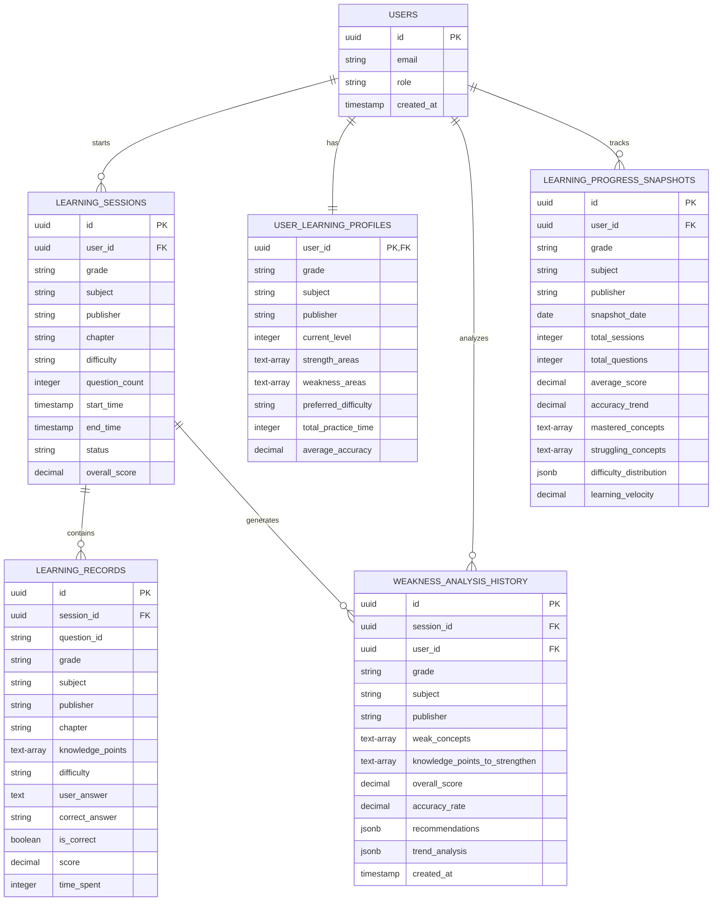
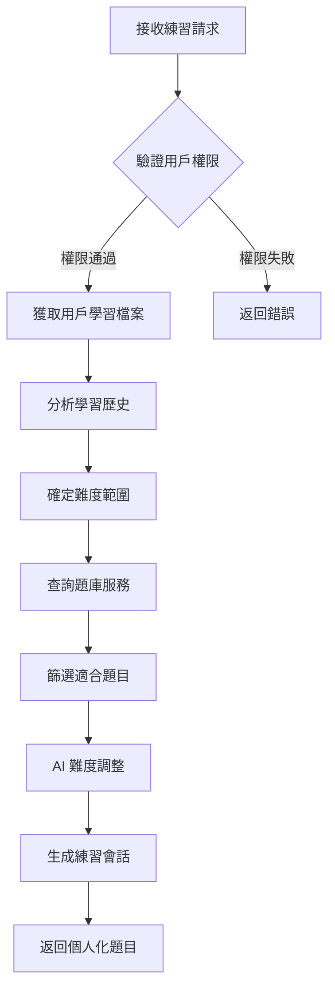
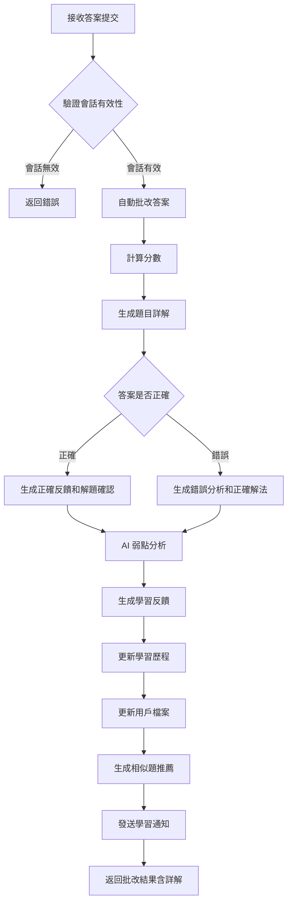
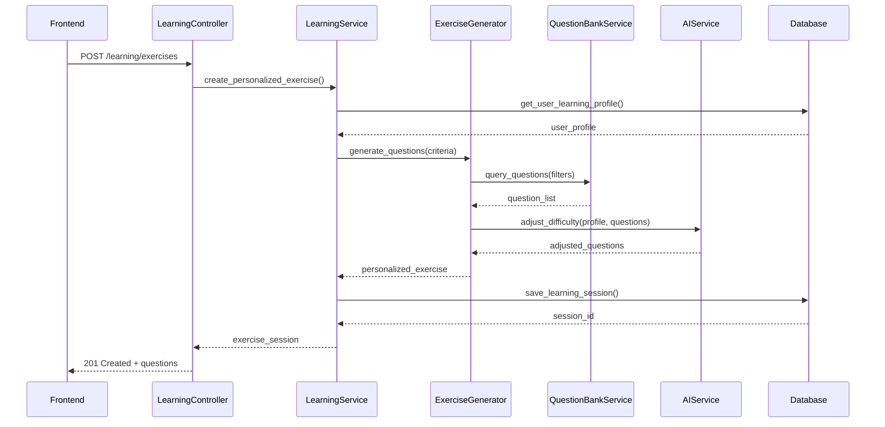

# 系統詳細設計文檔 (System Design Document) - InULearning 學習服務模組

---

**文件版本 (Document Version):** `v1.0`

**最後更新 (Last Updated):** `2024-07-26`

**主要作者/設計師 (Lead Author/Designer):** `AIPE01_group2`

**審核者 (Reviewers):** `AIPE01_group2 團隊成員`

**狀態 (Status):** `核心功能已實現 (Core Functionality Implemented)`

**相關系統架構文檔 (SA Document):** `02_system_architecture_document.md`

**相關 User Stories/Features:** `US-002 (智慧出題系統), US-003 (自動批改功能), US-004 (相似題練習), US-005 (學習歷程記錄), US-006 (AI 智慧化升級)`

**相關 ADRs (若適用):** `ADR-001 (技術選型), ADR-002 (架構模式), ADR-003 (資料庫設計)`

---

## 目錄 (Table of Contents)

1.  [引言 (Introduction)](#1-引言-introduction)
2.  [模組/功能概述 (Module/Feature Overview)](#2-模組功能概述-modulefeature-overview)
3.  [詳細設計 (Detailed Design)](#3-詳細設計-detailed-design)
4.  [設計考量 (Design Considerations)](#4-設計考量-design-considerations)
5.  [介面定義 (Interface Definitions)](#5-介面定義-interface-definitions)
6.  [未來展望 (Future Considerations)](#6-未來展望-future-considerations)
7.  [附錄 (Appendices)](#7-附錄-appendices)

---

## 1. 引言 (Introduction)

### 1.1 目的 (Purpose)
為 InULearning 個人化學習平台的核心學習服務模組提供詳細的技術實現規格和設計細節，指導開發團隊進行程式碼實作、單元測試和系統整合工作。本設計採用前後端分離架構，確保前端專注於用戶體驗，後端專注於業務邏輯和數據處理。此版本 (v1.0) 反映了核心功能上線後的最終設計。

### 1.2 範圍 (Scope)
本文件涵蓋學習服務模組的完整設計，包括智慧出題、自動批改、學習歷程追蹤、AI 分析整合等核心功能，但不包括前端 UI 設計和其他服務模組的詳細實現。

### 1.3 術語表 (Glossary)

| 術語/縮寫 | 完整名稱/解釋 |
| :------- | :----------- |
| LearningService | 學習服務 - 核心業務邏輯模組 |
| ExerciseSession | 練習會話 - 單次學習練習的完整過程 |
| WeaknessAnalysis | 弱點分析 - AI 對學習錯誤的分析結果 |
| AdaptiveLearning | 適應性學習 - 基於學習歷史的個人化學習 |
| QuestionBank | 題庫 - 存儲在 MongoDB 中的結構化題目集合 |
| KnowledgePoint | 知識點 - 題目所涵蓋的具體學習概念 |

### 1.4 參考文件 (References)
*   系統架構文檔: 02_system_architecture_document.md
*   專案摘要文檔: 00_project_summary.md
*   用戶認證服務 API 規範
*   題庫管理服務 API 規範
*   AI 分析服務 API 規範

---

## 2. 模組/功能概述 (Module/Feature Overview)

### 2.1 功能描述 (Functional Description)
學習服務模組是 InULearning 平台的核心業務邏輯中心，負責：

*   **個人化出題管理：** 根據學生年級（7A-9B）、版本（南一/翰林/康軒）、科目（國文/英文/數學/自然/地理/歷史/公民）、章節、難度（易/中/難）需求，結合學習歷史生成個人化練習題
*   **題庫練習管理：** 管理學生的完整學習會話，從開始練習到提交答案的全流程
*   **自動批改協調：** 協調自動批改服務對學生答案進行即時評分和分析
*   **學習歷程追蹤：** 完整記錄學生的學習行為、練習結果、進度變化，建立長期學習歷史
*   **AI 分析整合：** 整合 AI 服務進行弱點分析和相似題推薦，提供個人化學習建議
*   **弱點分析與建議：** 基於學習表現自動識別弱點概念，生成針對性的學習改進建議
*   **學習趨勢分析：** 持續追蹤學習進步趨勢，識別改善領域和持續弱點，提供長期學習洞察
*   **進度快照管理：** 定期創建學習進度快照，支持家長和教師查看學習成長軌跡
*   **學習數據管理：** 維護學生個人學習檔案和統計數據

### 2.2 與系統其他部分的關係 (Relationship to Other System Parts)

**前後端分離架構：** 學習服務作為後端核心服務，通過標準化的 RESTful API 與前端應用程式進行數據交換，確保前後端可以獨立開發、測試和部署。

*   **輸入 (Inputs):**
    *   用戶認證服務：通過 API 驗證用戶身份和權限信息
    *   題庫管理服務：通過 API 獲取題目資料和分類信息
    *   前端應用：通過 HTTP API 發送學習請求和答案提交
    *   AI 分析服務：通過 API 獲取學習分析和推薦結果

*   **輸出 (Outputs):**
    *   前端應用：通過 JSON API 提供練習題目、批改結果、學習報告
    *   AI 分析服務：通過 API 提供學習歷程資料用於分析
    *   報表服務：通過 API 提供統計數據用於報表生成
    *   通知服務：通過事件機制發送學習提醒和成績通知

*   **依賴 (Dependencies):**
    *   PostgreSQL：用戶和學習歷程資料存儲
    *   MongoDB：題目和練習結果存儲
    *   Redis：會話狀態和熱點數據快取
    *   RabbitMQ：異步任務和事件處理

---

## 3. 詳細設計 (Detailed Design)

### 3.1 模組結構與組件設計 (Module Structure and Component Design)

#### 3.1.1 類別圖/組件圖 (Class/Component Diagrams)

```mermaid
classDiagram
    class LearningController {
        +start_exercise_session(user_id: str, params: ExerciseParams): ExerciseSession
        +submit_answer(session_id: str, answers: List[Answer]): SubmissionResult
        +get_learning_history(user_id: str, filters: HistoryFilters): LearningHistory
        +get_recommendations(user_id: str): RecommendationResult
    }
    
    class LearningService {
        -exercise_generator: ExerciseGenerator
        -grading_coordinator: GradingCoordinator
        -learning_tracker: LearningTracker
        -ai_integrator: AIIntegrator
        +create_personalized_exercise(user_id: str, params: ExerciseParams): Exercise
        +process_submission(session: ExerciseSession, answers: List[Answer]): ProcessingResult
        +track_learning_progress(user_id: str, result: ProcessingResult): void
        +analyze_weaknesses(user_id: str): WeaknessAnalysis
    }
    
    class ExerciseGenerator {
        -question_bank_client: QuestionBankClient
        -difficulty_adjuster: DifficultyAdjuster
        +generate_questions(criteria: SelectionCriteria): List[Question]
        +adjust_difficulty(user_profile: UserProfile, questions: List[Question]): List[Question]
    }
    
    class GradingCoordinator {
        -auto_grader: AutoGrader
        -manual_grader: ManualGrader
        -explanation_generator: ExplanationGenerator
        +grade_answers(questions: List[Question], answers: List[Answer]): GradingResult
        +provide_feedback(grading_result: GradingResult): Feedback
        +generate_explanations(questions: List[Question], answers: List[Answer]): List[Explanation]
    }
    
    class LearningTracker {
        -learning_repository: ILearningRepository
        -progress_calculator: ProgressCalculator
        +record_session(session: ExerciseSession): void
        +calculate_progress(user_id: str, subject: str): ProgressReport
        +update_user_profile(user_id: str, performance: Performance): void
    }
    
    class AIIntegrator {
        -weakness_analyzer: WeaknessAnalyzer
        -recommendation_engine: RecommendationEngine
        +analyze_learning_pattern(learning_data: LearningData): AnalysisResult
        +generate_recommendations(user_profile: UserProfile, weakness: WeaknessAnalysis): List[Recommendation]
    }
    
    interface ILearningRepository {
        +save_session(session: ExerciseSession): str
        +get_user_learning_history(user_id: str): List[LearningRecord]
        +update_user_profile(profile: UserProfile): void
        +get_performance_stats(user_id: str, period: TimePeriod): PerformanceStats
    }
    
    class ExerciseSession {
        +session_id: str
        +user_id: str
        +questions: List[Question]
        +start_time: datetime
        +end_time: datetime
        +status: SessionStatus
        +metadata: dict
    }
    
    LearningController ..> LearningService : uses
    LearningService --> ExerciseGenerator : contains
    LearningService --> GradingCoordinator : contains
    LearningService --> LearningTracker : contains
    LearningService --> AIIntegrator : contains
    LearningTracker ..> ILearningRepository : uses
    LearningService ..> ExerciseSession : manages
```

#### 3.1.2 主要類別/介面/函式詳述 (Key Classes/Interfaces/Functions Details)

*   **`LearningController`**
    *   **職責:** HTTP API 端點控制器，處理前端學習相關請求
    *   **主要方法簽名:**
        *   `start_exercise_session(user_id: str, params: ExerciseParams) -> ExerciseSession`
            *   **描述:** 開始新的練習會話，生成個人化題目
            *   **參數:** 用戶ID和練習參數（年級、科目、章節、題數等）
            *   **回傳:** 包含題目的練習會話對象
            *   **主要邏輯:** 1) 驗證用戶權限 2) 調用學習服務創建練習 3) 返回會話信息

*   **`LearningService`**
    *   **職責:** 核心業務邏輯服務，協調各個子組件完成學習功能
    *   **主要方法簽名:**
        *   `create_personalized_exercise(user_id: str, params: ExerciseParams) -> Exercise`
            *   **描述:** 創建個人化練習題目集合
            *   **參數:** 用戶ID和練習參數
            *   **回傳:** 個人化練習對象
            *   **主要邏輯:** 1) 獲取用戶學習檔案 2) 調用題目生成器 3) AI 難度調整 4) 創建練習會話
        *   `process_submission(session: ExerciseSession, answers: List[Answer]) -> ProcessingResult`
            *   **描述:** 處理學生答案提交，包括批改、詳解生成和分析
            *   **參數:** 練習會話和學生答案列表
            *   **回傳:** 處理結果包含成績、詳解、分析、建議
            *   **主要邏輯:** 1) 自動批改 2) 生成題目詳解(不分對錯) 3) AI 弱點分析 4) 生成差異化反饋 5) 更新學習歷程

*   **`ExerciseGenerator`**
    *   **職責:** 根據條件生成個人化練習題目
    *   **主要方法簽名:**
        *   `generate_questions(criteria: SelectionCriteria) -> List[Question]`
            *   **描述:** 從題庫中選擇符合條件的題目
            *   **參數:** 選擇條件（科目、章節、難度、知識點等）
            *   **回傳:** 題目列表
            *   **主要邏輯:** 1) 查詢題庫服務 2) 過濾重複題目 3) 平衡題型分布

*   **`GradingCoordinator`**
    *   **職責:** 協調自動批改服務對學生答案進行即時評分、分析和詳解生成
    *   **主要方法簽名:**
        *   `grade_answers(questions: List[Question], answers: List[Answer]) -> GradingResult`
            *   **描述:** 批改學生答案並生成評分結果
            *   **參數:** 題目列表和學生答案列表
            *   **回傳:** 包含分數和正確性的批改結果
            *   **主要邏輯:** 1) 比對正確答案 2) 計算得分 3) 生成批改摘要
        *   `generate_explanations(questions: List[Question], answers: List[Answer]) -> List[Explanation]`
            *   **描述:** 為所有題目生成詳細解析，不分答對或答錯
            *   **參數:** 題目列表和學生答案列表
            *   **回傳:** 每個題目的詳細解析列表
            *   **主要邏輯:** 1) 分析學生答案 2) 生成解題步驟 3) 提供概念說明 4) 針對錯誤答案説明常見錯誤

*   **`ILearningRepository`**
    *   **職責:** 學習數據存取介面
    *   **主要方法簽名:**
        *   `save_session(session: ExerciseSession) -> str`
        *   `get_user_learning_history(user_id: str) -> List[LearningRecord]`
        *   `update_user_profile(profile: UserProfile) -> void`

### 3.2 API 設計 (API Design)

#### 3.2.1 外部 API (External/Public APIs)

本章節詳述學習服務模組的 API 設計，這些 API 已在 v1.0 中實現。您可以透過以下連結訪問線上互動式 API 文檔：
*   **[學習服務 API](http://localhost:8003/docs)**

*   **端點:** `POST /api/v1/learning/exercises`
*   **描述:** 開始新的個人化練習會話
*   **請求:**
    *   **Headers:** `Authorization: Bearer <JWT_TOKEN>`
    *   **請求體:**
        ```json
        {
          "grade": "8A",
          "subject": "數學",
          "publisher": "南一",
          "chapter": "1-1 一元一次方程式",
          "question_count": 10,
          "difficulty": "normal",
          "knowledge_points": ["方程式求解", "應用問題"]
        }
        ```
*   **回應:**
    *   **成功 (201 Created):**
        ```json
        {
          "session_id": "sess_123456789",
          "questions": [
            {
              "question_id": "q_001",
              "grade": "8A",
              "subject": "數學",
              "publisher": "南一",
              "chapter": "1-1 一元一次方程式",
              "topic": "一元一次方程式",
              "knowledge_point": ["方程式求解"],
              "difficulty": "normal",
              "question": "解下列方程式：2x + 5 = 13",
              "options": {
                "A": "x = 4",
                "B": "x = 6",
                "C": "x = 8",
                "D": "x = 10"
              },
              "answer": "A"
            }
          ],
          "estimated_time": 30,
          "created_at": "2024-12-19T10:30:00Z"
        }
        ```

*   **端點:** `POST /api/v1/learning/sessions/{session_id}/submit`
*   **描述:** 提交練習答案並獲得批改結果
*   **重要說明:** 
    *   **詳解提供:** 不管學生答對或答錯，系統都會提供完整的題目詳解 (`explanation`)
    *   **弱點分析保留:** 系統會分析學習表現並提供弱點分析 (`weakness_analysis`)，包含弱點概念、需加強知識點及個人化推薦
    *   **差異化反饋:** 答對時著重於解題步驟確認，答錯時重點說明正確解法和常見錯誤
    *   **學習導向:** 詳解內容以幫助學生理解概念為主，而非僅提供答案
*   **請求:**
    *   **Headers:** `Authorization: Bearer <JWT_TOKEN>`
    *   **路徑參數:** `session_id` (練習會話ID)
    *   **請求體:**
        ```json
        {
          "answers": [
            {
              "question_id": "q_001",
              "answer": "x = 4",
              "time_spent": 120
            }
          ]
        }
        ```
*   **回應:**
    *   **成功 (200 OK):**
        ```json
        {
          "session_id": "sess_123456789",
          "overall_score": 70,
          "results": [
            {
              "question_id": "q_001",
              "correct": true,
              "score": 10,
              "feedback": "答案正確！解題步驟清楚。",
              "explanation": "解一元一次方程式 2x + 5 = 13，首先將 5 移到等式右邊得到 2x = 13 - 5 = 8，再將兩邊同除以 2 得到 x = 4，因此正確答案是選項 A。"
            },
            {
              "question_id": "q_002",
              "correct": false,
              "score": 0,
              "feedback": "答案錯誤，請重新檢視解題步驟。",
              "explanation": "解方程式 3x - 7 = 8，正確做法是先將 -7 移到等式右邊得到 3x = 8 + 7 = 15，再將兩邊同除以 3 得到 x = 5，正確答案應該是選項 C，而不是選項 B。常見錯誤是在移項時符號處理不當。"
            },
            {
              "question_id": "q_003",
              "correct": true,
              "score": 8,
              "feedback": "答案正確，但可以更簡潔。",
              "explanation": "此題考查分數方程式的求解。將方程式 (2x+1)/3 = 5 兩邊同乘以 3 得到 2x + 1 = 15，再減去 1 得到 2x = 14，最後除以 2 得到 x = 7，答案是選項 D。"
            }
          ],
          "weakness_analysis": {
            "weak_concepts": ["移項運算", "符號處理", "分數方程式"],
            "knowledge_points_to_strengthen": ["一元一次方程式", "代數運算", "移項法則"],
            "recommendations": [
              {
                "type": "similar_question",
                "question_ids": ["q_101", "q_102", "q_103"],
                "difficulty": "easy",
                "reason": "建議從基礎移項運算加強練習"
              },
              {
                "type": "concept_review",
                "topics": ["移項法則", "符號變換"],
                "difficulty": "normal",
                "reason": "需要加強移項時的符號處理"
              }
            ]
          }
        }
        ```

*   **端點:** `GET /api/v1/learning/users/{user_id}/trends`
*   **描述:** 獲取學生學習趨勢分析和進步記錄
*   **請求:**
    *   **Headers:** `Authorization: Bearer <JWT_TOKEN>`
    *   **路徑參數:** `user_id` (學生用戶ID)
    *   **查詢參數:** 
        *   `subject` (科目，必填)
        *   `period_days` (分析期間天數，預設30天)
        *   `include_snapshots` (是否包含快照數據，預設false)
*   **回應:**
    *   **成功 (200 OK):**
        ```json
        {
          "user_id": "user_123",
          "subject": "數學",
          "period_start": "2024-11-19T00:00:00Z",
          "period_end": "2024-12-19T23:59:59Z",
          "score_trend": [
            {"date": "2024-12-01", "score": 65.5, "session_count": 3},
            {"date": "2024-12-08", "score": 72.3, "session_count": 4},
            {"date": "2024-12-15", "score": 78.9, "session_count": 2}
          ],
          "accuracy_trend": [
            {"date": "2024-12-01", "accuracy": 0.68, "total_questions": 30},
            {"date": "2024-12-08", "accuracy": 0.74, "total_questions": 40},
            {"date": "2024-12-15", "accuracy": 0.81, "total_questions": 20}
          ],
          "concept_mastery_progress": {
            "一元一次方程式": 0.85,
            "移項運算": 0.62,
            "分數方程式": 0.71,
            "應用問題": 0.58
          },
          "improvement_areas": ["移項運算", "基礎運算"],
          "persistent_weaknesses": ["應用問題", "文字題理解"],
          "learning_velocity_trend": 1.23,
          "weakness_analysis_history": [
            {
              "date": "2024-12-15",
              "weak_concepts": ["應用問題", "文字題理解"],
              "knowledge_points_to_strengthen": ["一元一次方程式", "代數運算"],
              "overall_score": 78.9,
              "accuracy_rate": 81.0
            }
          ]
        }
        ```

### 3.3 資料庫設計 (Data Model / Database Design)

#### 3.3.1 資料庫表結構/Schema

**表名: `learning_sessions`**

| 欄位名稱 | 資料型別 | 約束 | 描述/備註 |
| :------- | :------- | :--- | :-------- |
| `id` | `UUID` | `PRIMARY KEY` | 會話主鍵 |
| `user_id` | `UUID` | `NOT NULL, REFERENCES users(id)` | 關聯用戶ID |
| `session_type` | `VARCHAR(50)` | `NOT NULL` | 會話類型(練習/測驗/複習) |
| `grade` | `VARCHAR(10)` | `NOT NULL` | 年級(7A/7B/8A/8B/9A/9B) |
| `subject` | `VARCHAR(50)` | `NOT NULL` | 科目(國文/英文/數學/自然/地理/歷史/公民) |
| `publisher` | `VARCHAR(20)` | `NOT NULL` | 版本(南一/翰林/康軒) |
| `chapter` | `VARCHAR(200)` | `NULL` | 章節 |
| `difficulty` | `VARCHAR(20)` | `NULL` | 指定難度(easy/normal/hard) |
| `question_count` | `INTEGER` | `NOT NULL` | 題目數量 |
| `start_time` | `TIMESTAMP WITH TIME ZONE` | `NOT NULL DEFAULT NOW()` | 開始時間 |
| `end_time` | `TIMESTAMP WITH TIME ZONE` | `NULL` | 結束時間 |
| `status` | `VARCHAR(20)` | `NOT NULL DEFAULT 'active'` | 狀態(active/completed/abandoned) |
| `overall_score` | `DECIMAL(5,2)` | `NULL` | 總分 |
| `time_spent` | `INTEGER` | `NULL` | 花費時間(秒) |
| `metadata` | `JSONB` | `NULL` | 額外元數據 |
| `created_at` | `TIMESTAMP WITH TIME ZONE` | `NOT NULL DEFAULT NOW()` | 創建時間 |
| `updated_at` | `TIMESTAMP WITH TIME ZONE` | `NOT NULL DEFAULT NOW()` | 更新時間 |

**表名: `learning_records`**

| 欄位名稱 | 資料型別 | 約束 | 描述/備註 |
| :------- | :------- | :--- | :-------- |
| `id` | `UUID` | `PRIMARY KEY` | 記錄主鍵 |
| `session_id` | `UUID` | `NOT NULL, REFERENCES learning_sessions(id)` | 關聯會話ID |
| `question_id` | `VARCHAR(100)` | `NOT NULL` | MongoDB中的題目ID |
| `grade` | `VARCHAR(10)` | `NOT NULL` | 年級(7A/7B/8A/8B/9A/9B) |
| `subject` | `VARCHAR(50)` | `NOT NULL` | 科目(國文/英文/數學/自然/地理/歷史/公民) |
| `publisher` | `VARCHAR(20)` | `NOT NULL` | 版本(南一/翰林/康軒) |
| `chapter` | `VARCHAR(200)` | `NOT NULL` | 章節 |
| `topic` | `VARCHAR(200)` | `NULL` | 主題 |
| `knowledge_points` | `TEXT[]` | `NULL` | 知識點標籤 |
| `difficulty` | `VARCHAR(20)` | `NOT NULL` | 難度(easy/normal/hard) |
| `user_answer` | `TEXT` | `NULL` | 學生答案 |
| `correct_answer` | `VARCHAR(5)` | `NOT NULL` | 正確答案(A/B/C/D) |
| `is_correct` | `BOOLEAN` | `NULL` | 是否正確 |
| `score` | `DECIMAL(5,2)` | `NULL` | 得分 |
| `time_spent` | `INTEGER` | `NULL` | 花費時間(秒) |
| `created_at` | `TIMESTAMP WITH TIME ZONE` | `NOT NULL DEFAULT NOW()` | 創建時間 |

**表名: `user_learning_profiles`**

| 欄位名稱 | 資料型別 | 約束 | 描述/備註 |
| :------- | :------- | :--- | :-------- |
| `user_id` | `UUID` | `PRIMARY KEY, REFERENCES users(id)` | 用戶ID |
| `grade` | `VARCHAR(10)` | `NOT NULL` | 當前年級(7A/7B/8A/8B/9A/9B) |
| `subject` | `VARCHAR(50)` | `NOT NULL` | 科目(國文/英文/數學/自然/地理/歷史/公民) |
| `publisher` | `VARCHAR(20)` | `NOT NULL` | 主要使用版本(南一/翰林/康軒) |
| `current_level` | `INTEGER` | `NOT NULL DEFAULT 1` | 當前水平(1-10) |
| `strength_areas` | `TEXT[]` | `NULL` | 強項知識點 |
| `weakness_areas` | `TEXT[]` | `NULL` | 弱項知識點 |
| `preferred_difficulty` | `VARCHAR(20)` | `NULL` | 偏好難度(easy/normal/hard) |
| `learning_preferences` | `JSONB` | `NULL` | 學習偏好 |
| `total_practice_time` | `INTEGER` | `NOT NULL DEFAULT 0` | 總練習時間(分鐘) |
| `total_questions_answered` | `INTEGER` | `NOT NULL DEFAULT 0` | 總答題數 |
| `average_accuracy` | `DECIMAL(5,2)` | `NULL` | 平均準確率 |
| `last_practice_date` | `DATE` | `NULL` | 最後練習日期 |
| `created_at` | `TIMESTAMP WITH TIME ZONE` | `NOT NULL DEFAULT NOW()` | 創建時間 |
| `updated_at` | `TIMESTAMP WITH TIME ZONE` | `NOT NULL DEFAULT NOW()` | 更新時間 |

**表名: `weakness_analysis_history`**

| 欄位名稱 | 資料型別 | 約束 | 描述/備註 |
| :------- | :------- | :--- | :-------- |
| `id` | `UUID` | `PRIMARY KEY` | 分析記錄主鍵 |
| `session_id` | `UUID` | `NOT NULL, REFERENCES learning_sessions(id)` | 關聯學習會話ID |
| `user_id` | `UUID` | `NOT NULL, REFERENCES users(id)` | 用戶ID |
| `grade` | `VARCHAR(10)` | `NOT NULL` | 年級(7A/7B/8A/8B/9A/9B) |
| `subject` | `VARCHAR(50)` | `NOT NULL` | 科目(國文/英文/數學/自然/地理/歷史/公民) |
| `publisher` | `VARCHAR(20)` | `NOT NULL` | 版本(南一/翰林/康軒) |
| `weak_concepts` | `TEXT[]` | `NOT NULL` | 識別出的弱點概念 |
| `knowledge_points_to_strengthen` | `TEXT[]` | `NOT NULL` | 需要加強的知識點 |
| `overall_score` | `DECIMAL(5,2)` | `NOT NULL` | 本次練習總分 |
| `accuracy_rate` | `DECIMAL(5,2)` | `NOT NULL` | 本次練習準確率 |
| `improvement_suggestions` | `JSONB` | `NULL` | AI生成的改進建議 |
| `trend_analysis` | `JSONB` | `NULL` | 與歷史表現的趨勢比較 |
| `recommendations` | `JSONB` | `NOT NULL` | 個人化學習推薦 |
| `analysis_version` | `VARCHAR(10)` | `NOT NULL DEFAULT 'v1.0'` | 分析算法版本 |
| `created_at` | `TIMESTAMP WITH TIME ZONE` | `NOT NULL DEFAULT NOW()` | 分析時間 |

**表名: `learning_progress_snapshots`**

| 欄位名稱 | 資料型別 | 約束 | 描述/備註 |
| :------- | :------- | :--- | :-------- |
| `id` | `UUID` | `PRIMARY KEY` | 快照主鍵 |
| `user_id` | `UUID` | `NOT NULL, REFERENCES users(id)` | 用戶ID |
| `grade` | `VARCHAR(10)` | `NOT NULL` | 年級 |
| `subject` | `VARCHAR(50)` | `NOT NULL` | 科目 |
| `publisher` | `VARCHAR(20)` | `NOT NULL` | 版本 |
| `snapshot_date` | `DATE` | `NOT NULL` | 快照日期 |
| `total_sessions` | `INTEGER` | `NOT NULL DEFAULT 0` | 累計學習會話數 |
| `total_questions` | `INTEGER` | `NOT NULL DEFAULT 0` | 累計答題數 |
| `average_score` | `DECIMAL(5,2)` | `NULL` | 平均分數 |
| `accuracy_trend` | `DECIMAL(5,2)` | `NULL` | 準確率趨勢 |
| `mastered_concepts` | `TEXT[]` | `NULL` | 已掌握概念 |
| `struggling_concepts` | `TEXT[]` | `NULL` | 仍在學習的概念 |
| `difficulty_distribution` | `JSONB` | `NULL` | 各難度級別的表現分佈 |
| `learning_velocity` | `DECIMAL(5,2)` | `NULL` | 學習速度指標 |
| `created_at` | `TIMESTAMP WITH TIME ZONE` | `NOT NULL DEFAULT NOW()` | 創建時間 |

*   **索引:** 
    *   `idx_learning_sessions_user_id` on `learning_sessions(user_id)`
    *   `idx_learning_sessions_grade_subject` on `learning_sessions(grade, subject)`
    *   `idx_learning_records_session_id` on `learning_records(session_id)`
    *   `idx_learning_records_grade_subject` on `learning_records(grade, subject, publisher)`
    *   `idx_learning_records_knowledge_points` on `learning_records` using GIN `(knowledge_points)`
    *   `idx_user_learning_profiles_composite` on `user_learning_profiles(user_id, grade, subject)`
    *   `idx_weakness_analysis_user_subject` on `weakness_analysis_history(user_id, subject, created_at)`
    *   `idx_weakness_analysis_session` on `weakness_analysis_history(session_id)`
    *   `idx_weakness_analysis_concepts` on `weakness_analysis_history` using GIN `(weak_concepts)`
    *   `idx_progress_snapshots_user_date` on `learning_progress_snapshots(user_id, subject, snapshot_date)`
    *   `idx_progress_snapshots_trends` on `learning_progress_snapshots(user_id, grade, subject, snapshot_date)`

#### 3.3.2 ER 圖 (Entity-Relationship Diagram)



### 3.4 核心演算法/邏輯流程 (Core Algorithms / Logic Flow)

#### 3.4.1 主要業務流程圖 (Key Business Process Flows)

**個人化出題流程**


**答案提交處理流程**


#### 3.4.2 序列圖 (Sequence Diagrams)

**學習會話創建序列**


### 3.5 錯誤處理與例外機制 (Error Handling and Exception Strategy)

*   **主要例外類型:**
    *   `UserNotAuthenticatedException`: 用戶未認證
    *   `InvalidSessionException`: 無效的學習會話
    *   `QuestionBankUnavailableException`: 題庫服務不可用
    *   `AIServiceTimeoutException`: AI 服務超時
    *   `InsufficientQuestionsException`: 題目數量不足

*   **錯誤日誌記錄:**
    ```json
    {
      "timestamp": "2024-12-19T10:30:00Z",
      "level": "ERROR",
      "service": "learning-service",
      "trace_id": "trace_123",
      "user_id": "user_456",
      "error_code": "QUESTION_BANK_UNAVAILABLE",
      "message": "Failed to fetch questions from question bank",
      "stack_trace": "...",
      "context": {
        "session_id": "sess_789",
        "subject": "mathematics",
        "retry_count": 2
      }
    }
    ```

*   **重試機制:**
    *   題庫查詢失敗：指數退避重試，最多 3 次
    *   AI 服務超時：降級到預設推薦算法
    *   資料庫連接失敗：立即重試 1 次，失敗則返回錯誤

### 3.6 配置管理 (Configuration)

| 配置項 | 描述 | 型別 | 預設值 | 環境變數名 |
| :--- | :--- | :--- | :--- | :--- |
| `MONGODB_URI` | MongoDB 題庫連接字串 | `String` | `mongodb://localhost:27017/inulearning` | `LEARNING_MONGODB_URI` |
| `QUESTION_COLLECTION` | 題庫集合名稱 | `String` | `questions` | `LEARNING_QUESTION_COLLECTION` |
| `AI_SERVICE_API_URL` | AI 服務 API 地址 | `String` | `http://localhost:8002` | `LEARNING_AI_API_URL` |
| `DEFAULT_QUESTION_COUNT` | 預設題目數量 | `Integer` | `10` | `LEARNING_DEFAULT_COUNT` |
| `MAX_SESSION_DURATION_HOURS` | 最大會話持續時間(小時) | `Integer` | `2` | `LEARNING_MAX_SESSION_HOURS` |
| `SUPPORTED_GRADES` | 支援的年級列表 | `List[String]` | `["7A","7B","8A","8B","9A","9B"]` | `LEARNING_SUPPORTED_GRADES` |
| `SUPPORTED_SUBJECTS` | 支援的科目列表 | `List[String]` | `["國文","英文","數學","自然","地理","歷史","公民"]` | `LEARNING_SUPPORTED_SUBJECTS` |
| `SUPPORTED_PUBLISHERS` | 支援的版本列表 | `List[String]` | `["南一","翰林","康軒"]` | `LEARNING_SUPPORTED_PUBLISHERS` |
| `EXPLANATION_REQUIRED` | 是否強制生成詳解 | `Boolean` | `true` | `LEARNING_EXPLANATION_REQUIRED` |
| `EXPLANATION_MAX_LENGTH` | 詳解最大字數 | `Integer` | `500` | `LEARNING_EXPLANATION_MAX_LENGTH` |

---

## 4. 設計考量 (Design Considerations)

### 4.1 架構設計理念 (Architecture Design Philosophy)
*   **前後端分離:** 採用完全前後端分離的架構設計，前端負責展示層和用戶交互，後端提供 RESTful API 服務
*   **API 優先設計:** 所有功能都通過標準化的 HTTP API 提供，確保前端可以獨立開發和部署
*   **數據格式標準化:** 使用 JSON 作為數據交換格式，API 回應結構保持一致性和可預測性
*   **狀態無關性:** 後端服務設計為無狀態，所有會話信息通過 JWT 或數據庫管理，支持水平擴展
*   **跨域支持:** 支持 CORS 配置，允許前端應用從不同域名訪問 API

### 4.2 安全性 (Security)
*   **輸入驗證:** 所有 API 輸入參數使用 Pydantic 模型進行嚴格驗證
*   **權限控制:** 學生只能存取自己的學習數據，家長可查看關聯學生數據
*   **數據加密:** 敏感學習數據在資料庫中加密存儲
*   **SQL 注入防護:** 使用 SQLAlchemy ORM 避免 SQL 注入
*   **API 速率限制:** 每用戶每分鐘最多 100 次 API 調用

### 4.3 性能 (Performance)
*   **目標響應時間:** API 端點 P95 < 500ms
*   **快取策略:** 
    *   用戶學習檔案快取 1 小時
    *   熱門題目快取 30 分鐘
    *   學習統計資料快取 24 小時
*   **資料庫優化:** 
    *   使用資料庫連接池（最大 20 連接）
    *   為高頻查詢欄位建立索引
    *   學習記錄表按月分表
*   **異步處理:** AI 分析和推薦生成使用 Celery 異步執行

### 4.4 可擴展性 (Scalability)
*   **無狀態設計:** 學習服務實例無狀態，支持水平擴展
*   **資料庫分離:** 讀寫分離，讀取操作分散到從庫
*   **分散式快取:** 使用 Redis Cluster 支持快取擴展
*   **服務拆分:** 預留接口支持後續拆分為更細粒度的微服務

### 4.5 可靠性與容錯 (Reliability & Fault Tolerance)
*   **服務降級:** AI 服務不可用時，使用規則引擎提供基礎推薦
*   **熔斷器模式:** 對外部服務調用實現熔斷保護
*   **檔案存儲容錯:** 題目多媒體資源存儲在MinIO對象存儲中，具備高可用性和故障恢復能力
*   **資料備份:** 學習數據每日增量備份，每週全量備份
*   **冪等性保證:** 答案提交 API 支持冪等重複提交
*   **事務管理:** 關鍵業務操作使用資料庫事務保證一致性

### 4.6 可測試性 (Testability)
*   **依賴注入:** 使用 FastAPI 的依賴注入系統，便於 Mock 測試
*   **介面抽象:** 資料庫操作和外部服務調用都有介面抽象
*   **測試數據:** 提供完整的測試數據集和 Mock 服務
*   **單元測試:** 目標測試覆蓋率 > 80%
*   **整合測試:** 使用 TestContainers 進行資料庫整合測試

### 4.7 可維護性 (Maintainability)
*   **程式碼結構:** 採用分層架構，清晰的職責劃分
*   **程式碼品質:** 使用 Black、isort、flake8 進行程式碼格式化和靜態檢查
*   **文檔完整性:** API 文檔自動生成，關鍵業務邏輯有詳細註解
*   **配置外化:** 所有配置參數通過環境變數管理
*   **監控告警:** 關鍵指標監控和異常告警機制

### 4.8 部署考量 (Deployment)
*   **容器化:** 使用 Docker 容器化部署
*   **環境隔離:** 開發、測試、生產環境完全隔離
*   **滾動更新:** 支持零停機滾動更新
*   **健康檢查:** 提供 `/health` 端點用於負載均衡器健康檢查
*   **配置管理:** 敏感配置使用 Kubernetes Secrets 管理

---

## 5. 介面定義 (Interface Definitions)

### 5.1 內部服務介面

```python
from abc import ABC, abstractmethod
from typing import List, Optional
from datetime import datetime

class ILearningRepository(ABC):
    @abstractmethod
    async def save_session(self, session: ExerciseSession) -> str:
        """保存學習會話"""
        pass
    
    @abstractmethod
    async def get_user_learning_profile(self, user_id: str, subject: str) -> Optional[UserLearningProfile]:
        """獲取用戶學習檔案"""
        pass
    
    @abstractmethod
    async def record_learning_result(self, session_id: str, records: List[LearningRecord]) -> None:
        """記錄學習結果"""
        pass
    
    @abstractmethod
    async def save_weakness_analysis(self, session_id: str, user_id: str, analysis: WeaknessAnalysis) -> str:
        """保存弱點分析歷史記錄"""
        pass
    
    @abstractmethod
    async def get_weakness_history(self, user_id: str, subject: str, limit: int = 10) -> List[WeaknessAnalysisRecord]:
        """獲取用戶弱點分析歷史"""
        pass
    
    @abstractmethod
    async def create_progress_snapshot(self, user_id: str, grade: str, subject: str, publisher: str) -> None:
        """創建學習進度快照"""
        pass
    
    @abstractmethod
    async def get_learning_trends(self, user_id: str, subject: str, period_days: int = 30) -> LearningTrends:
        """獲取學習趨勢分析"""
        pass

class IQuestionBankClient(ABC):
    @abstractmethod
    async def search_questions(self, criteria: SearchCriteria) -> List[Question]:
        """從 MongoDB 搜尋題目"""
        pass
    
    @abstractmethod
    async def get_questions_by_criteria(
        self, 
        grade: str, 
        subject: str, 
        publisher: str, 
        chapter: Optional[str] = None,
        difficulty: Optional[str] = None,
        knowledge_points: Optional[List[str]] = None,
        limit: int = 10
    ) -> List[Question]:
        """根據條件獲取題目"""
        pass
    
    @abstractmethod
    async def get_random_questions(
        self,
        grade: str,
        subject: str, 
        publisher: str,
        count: int = 10,
        exclude_ids: Optional[List[str]] = None
    ) -> List[Question]:
        """隨機獲取題目"""
        pass

class IAIAnalysisClient(ABC):
    @abstractmethod
    async def analyze_weaknesses(self, learning_data: LearningData) -> WeaknessAnalysis:
        """分析學習弱點"""
        pass
    
    @abstractmethod
    async def recommend_questions(self, user_profile: UserProfile, weakness: WeaknessAnalysis) -> List[str]:
        """推薦題目"""
        pass
```

### 5.2 數據模型定義

```python
from pydantic import BaseModel, Field
from typing import List, Optional, Dict, Any
from datetime import datetime
from enum import Enum

class SessionStatus(str, Enum):
    ACTIVE = "active"
    COMPLETED = "completed"
    ABANDONED = "abandoned"

class GradeEnum(str, Enum):
    GRADE_7A = "7A"
    GRADE_7B = "7B"
    GRADE_8A = "8A"
    GRADE_8B = "8B"
    GRADE_9A = "9A"
    GRADE_9B = "9B"

class SubjectEnum(str, Enum):
    CHINESE = "國文"
    ENGLISH = "英文"
    MATH = "數學"
    SCIENCE = "自然"
    GEOGRAPHY = "地理"
    HISTORY = "歷史"
    CIVICS = "公民"

class PublisherEnum(str, Enum):
    NANI = "南一"
    HANLIN = "翰林"
    KANGXUAN = "康軒"

class DifficultyEnum(str, Enum):
    EASY = "easy"
    NORMAL = "normal"
    HARD = "hard"

class ExerciseParams(BaseModel):
    grade: GradeEnum = Field(..., description="年級(7A-9B)")
    subject: SubjectEnum = Field(..., description="科目")
    publisher: PublisherEnum = Field(..., description="教材版本")
    chapter: Optional[str] = Field(None, description="章節")
    question_count: int = Field(10, ge=1, le=50, description="題目數量")
    difficulty: Optional[DifficultyEnum] = Field(None, description="難度等級")
    knowledge_points: Optional[List[str]] = Field(None, description="指定知識點")

class Question(BaseModel):
    question_id: str
    grade: str
    subject: str
    publisher: str
    chapter: str
    topic: str
    knowledge_point: List[str]
    difficulty: str
    question: str
    options: Dict[str, str]  # {"A": "選項A", "B": "選項B", ...}
    answer: str  # 正確答案選項 (A/B/C/D)
    explanation: Optional[str] = None

class Answer(BaseModel):
    question_id: str
    answer: str
    time_spent: Optional[int] = None

class QuestionResult(BaseModel):
    question_id: str
    correct: bool
    score: float
    feedback: str
    explanation: str = Field(
        ..., 
        description="題目詳解說明，不管答對或答錯都提供完整解題步驟和概念說明"
    )

class Recommendation(BaseModel):
    type: str = Field(..., description="推薦類型 (similar_question, concept_review, practice_set)")
    question_ids: Optional[List[str]] = Field(None, description="推薦題目ID列表")
    topics: Optional[List[str]] = Field(None, description="推薦複習主題")
    difficulty: str = Field(..., description="推薦難度")
    reason: str = Field(..., description="推薦原因說明")

class WeaknessAnalysis(BaseModel):
    weak_concepts: List[str] = Field(..., description="學習弱點概念")
    knowledge_points_to_strengthen: List[str] = Field(..., description="需要加強的知識點")
    recommendations: List[Recommendation] = Field(..., description="個人化學習建議")

class SubmissionResult(BaseModel):
    session_id: str
    overall_score: float
    results: List[QuestionResult]
    weakness_analysis: Optional[WeaknessAnalysis] = Field(None, description="弱點分析結果，包含學習建議和推薦")

class WeaknessAnalysisRecord(BaseModel):
    id: str
    session_id: str
    user_id: str
    grade: str
    subject: str
    publisher: str
    weak_concepts: List[str]
    knowledge_points_to_strengthen: List[str]
    overall_score: float
    accuracy_rate: float
    improvement_suggestions: Optional[Dict[str, Any]] = None
    trend_analysis: Optional[Dict[str, Any]] = None
    recommendations: List[Recommendation]
    analysis_version: str = "v1.0"
    created_at: datetime

class ProgressSnapshot(BaseModel):
    id: str
    user_id: str
    grade: str
    subject: str
    publisher: str
    snapshot_date: datetime
    total_sessions: int
    total_questions: int
    average_score: Optional[float] = None
    accuracy_trend: Optional[float] = None
    mastered_concepts: Optional[List[str]] = None
    struggling_concepts: Optional[List[str]] = None
    difficulty_distribution: Optional[Dict[str, Any]] = None
    learning_velocity: Optional[float] = None
    created_at: datetime

class LearningTrends(BaseModel):
    user_id: str
    subject: str
    period_start: datetime
    period_end: datetime
    score_trend: List[Dict[str, Any]] = Field(..., description="分數趨勢資料點")
    accuracy_trend: List[Dict[str, Any]] = Field(..., description="準確率趨勢資料點")
    concept_mastery_progress: Dict[str, float] = Field(..., description="各概念掌握進度")
    improvement_areas: List[str] = Field(..., description="有改善的弱點領域")
    persistent_weaknesses: List[str] = Field(..., description="持續的弱點領域")
    learning_velocity_trend: Optional[float] = Field(None, description="學習速度趨勢")

class ExerciseSession(BaseModel):
    session_id: str
    user_id: str
    questions: List[Question]
    start_time: datetime
    end_time: Optional[datetime] = None
    status: SessionStatus
    metadata: Dict[str, Any] = Field(default_factory=dict)
```

---

## 6. 未來展望 (Future Considerations)

*   **機器學習模型整合:** 開發專屬的學習分析模型，提升推薦準確性
*   **實時協作學習:** 支持多人同時練習和討論功能
*   **語音識別整合:** 支持語音答題和口語評估
*   **學習路徑規劃:** 基於知識圖譜的智能學習路徑推薦
*   **遊戲化機制:** 引入積分、徽章、排行榜等遊戲化元素
*   **多模態學習:** 支持圖像、視頻等多媒體學習內容

---

## 7. 附錄 (Appendices)

### 7.1 API 錯誤碼對照表

| 錯誤碼 | HTTP 狀態碼 | 描述 |
| :--- | :--- | :--- |
| `LEARNING_001` | 400 | 無效的練習參數 |
| `LEARNING_002` | 401 | 用戶未認證 |
| `LEARNING_003` | 403 | 無權限存取 |
| `LEARNING_004` | 404 | 學習會話不存在 |
| `LEARNING_005` | 409 | 會話已結束無法提交 |
| `LEARNING_006` | 500 | MongoDB 題庫連接失敗 |
| `LEARNING_007` | 500 | AI 服務不可用 |
| `LEARNING_008` | 400 | 不支援的年級或科目組合 |
| `LEARNING_009` | 404 | 指定條件下無可用題目 |
| `LEARNING_010` | 400 | 無效的版本參數 |

### 7.2 資料庫遷移腳本範例

```sql
-- 創建學習會話表
CREATE TABLE learning_sessions (
    id UUID PRIMARY KEY DEFAULT gen_random_uuid(),
    user_id UUID NOT NULL REFERENCES users(id),
    session_type VARCHAR(50) NOT NULL,
    grade VARCHAR(10) NOT NULL,
    subject VARCHAR(50) NOT NULL,
    publisher VARCHAR(20) NOT NULL,
    chapter VARCHAR(200),
    difficulty VARCHAR(20),
    question_count INTEGER NOT NULL,
    start_time TIMESTAMP WITH TIME ZONE NOT NULL DEFAULT NOW(),
    end_time TIMESTAMP WITH TIME ZONE,
    status VARCHAR(20) NOT NULL DEFAULT 'active',
    overall_score DECIMAL(5,2),
    time_spent INTEGER,
    metadata JSONB,
    created_at TIMESTAMP WITH TIME ZONE NOT NULL DEFAULT NOW(),
    updated_at TIMESTAMP WITH TIME ZONE NOT NULL DEFAULT NOW()
);

-- 創建學習記錄表
CREATE TABLE learning_records (
    id UUID PRIMARY KEY DEFAULT gen_random_uuid(),
    session_id UUID NOT NULL REFERENCES learning_sessions(id),
    question_id VARCHAR(100) NOT NULL,
    grade VARCHAR(10) NOT NULL,
    subject VARCHAR(50) NOT NULL,
    publisher VARCHAR(20) NOT NULL,
    chapter VARCHAR(200) NOT NULL,
    topic VARCHAR(200),
    knowledge_points TEXT[],
    difficulty VARCHAR(20) NOT NULL,
    user_answer TEXT,
    correct_answer VARCHAR(5) NOT NULL,
    is_correct BOOLEAN,
    score DECIMAL(5,2),
    time_spent INTEGER,
    created_at TIMESTAMP WITH TIME ZONE NOT NULL DEFAULT NOW()
);

-- 創建用戶學習檔案表
CREATE TABLE user_learning_profiles (
    user_id UUID NOT NULL REFERENCES users(id),
    grade VARCHAR(10) NOT NULL,
    subject VARCHAR(50) NOT NULL,
    publisher VARCHAR(20) NOT NULL,
    current_level INTEGER NOT NULL DEFAULT 1,
    strength_areas TEXT[],
    weakness_areas TEXT[],
    preferred_difficulty VARCHAR(20),
    learning_preferences JSONB,
    total_practice_time INTEGER NOT NULL DEFAULT 0,
    total_questions_answered INTEGER NOT NULL DEFAULT 0,
    average_accuracy DECIMAL(5,2),
    last_practice_date DATE,
    created_at TIMESTAMP WITH TIME ZONE NOT NULL DEFAULT NOW(),
    updated_at TIMESTAMP WITH TIME ZONE NOT NULL DEFAULT NOW(),
    PRIMARY KEY (user_id, grade, subject, publisher)
);

-- 創建弱點分析歷史記錄表
CREATE TABLE weakness_analysis_history (
    id UUID PRIMARY KEY DEFAULT gen_random_uuid(),
    session_id UUID NOT NULL REFERENCES learning_sessions(id),
    user_id UUID NOT NULL REFERENCES users(id),
    grade VARCHAR(10) NOT NULL,
    subject VARCHAR(50) NOT NULL,
    publisher VARCHAR(20) NOT NULL,
    weak_concepts TEXT[] NOT NULL,
    knowledge_points_to_strengthen TEXT[] NOT NULL,
    overall_score DECIMAL(5,2) NOT NULL,
    accuracy_rate DECIMAL(5,2) NOT NULL,
    improvement_suggestions JSONB,
    trend_analysis JSONB,
    recommendations JSONB NOT NULL,
    analysis_version VARCHAR(10) NOT NULL DEFAULT 'v1.0',
    created_at TIMESTAMP WITH TIME ZONE NOT NULL DEFAULT NOW()
);

-- 創建學習進度快照表
CREATE TABLE learning_progress_snapshots (
    id UUID PRIMARY KEY DEFAULT gen_random_uuid(),
    user_id UUID NOT NULL REFERENCES users(id),
    grade VARCHAR(10) NOT NULL,
    subject VARCHAR(50) NOT NULL,
    publisher VARCHAR(20) NOT NULL,
    snapshot_date DATE NOT NULL,
    total_sessions INTEGER NOT NULL DEFAULT 0,
    total_questions INTEGER NOT NULL DEFAULT 0,
    average_score DECIMAL(5,2),
    accuracy_trend DECIMAL(5,2),
    mastered_concepts TEXT[],
    struggling_concepts TEXT[],
    difficulty_distribution JSONB,
    learning_velocity DECIMAL(5,2),
    created_at TIMESTAMP WITH TIME ZONE NOT NULL DEFAULT NOW(),
    UNIQUE(user_id, grade, subject, publisher, snapshot_date)
);

-- 建立索引
CREATE INDEX idx_learning_sessions_user_id ON learning_sessions(user_id);
CREATE INDEX idx_learning_sessions_grade_subject ON learning_sessions(grade, subject);
CREATE INDEX idx_learning_sessions_status ON learning_sessions(status);

CREATE INDEX idx_learning_records_session_id ON learning_records(session_id);
CREATE INDEX idx_learning_records_grade_subject ON learning_records(grade, subject, publisher);
CREATE INDEX idx_learning_records_knowledge_points ON learning_records USING GIN (knowledge_points);

CREATE INDEX idx_user_learning_profiles_composite ON user_learning_profiles(user_id, grade, subject);

-- 為弱點分析歷史表建立索引
CREATE INDEX idx_weakness_analysis_user_subject ON weakness_analysis_history(user_id, subject, created_at);
CREATE INDEX idx_weakness_analysis_session ON weakness_analysis_history(session_id);
CREATE INDEX idx_weakness_analysis_concepts ON weakness_analysis_history USING GIN (weak_concepts);
CREATE INDEX idx_weakness_analysis_knowledge_points ON weakness_analysis_history USING GIN (knowledge_points_to_strengthen);

-- 為學習進度快照表建立索引
CREATE INDEX idx_progress_snapshots_user_date ON learning_progress_snapshots(user_id, subject, snapshot_date);
CREATE INDEX idx_progress_snapshots_trends ON learning_progress_snapshots(user_id, grade, subject, snapshot_date);
CREATE INDEX idx_progress_snapshots_concepts ON learning_progress_snapshots USING GIN (mastered_concepts);
CREATE INDEX idx_progress_snapshots_struggling ON learning_progress_snapshots USING GIN (struggling_concepts);

-- 添加約束檢查
ALTER TABLE learning_sessions ADD CONSTRAINT chk_grade 
    CHECK (grade IN ('7A','7B','8A','8B','9A','9B'));
    
ALTER TABLE learning_sessions ADD CONSTRAINT chk_subject 
    CHECK (subject IN ('國文','英文','數學','自然','地理','歷史','公民'));
    
ALTER TABLE learning_sessions ADD CONSTRAINT chk_publisher 
    CHECK (publisher IN ('南一','翰林','康軒'));
    
ALTER TABLE learning_sessions ADD CONSTRAINT chk_difficulty 
    CHECK (difficulty IN ('easy','normal','hard'));

-- 為弱點分析歷史表添加約束
ALTER TABLE weakness_analysis_history ADD CONSTRAINT chk_weakness_grade 
    CHECK (grade IN ('7A','7B','8A','8B','9A','9B'));
    
ALTER TABLE weakness_analysis_history ADD CONSTRAINT chk_weakness_subject 
    CHECK (subject IN ('國文','英文','數學','自然','地理','歷史','公民'));
    
ALTER TABLE weakness_analysis_history ADD CONSTRAINT chk_weakness_publisher 
    CHECK (publisher IN ('南一','翰林','康軒'));

ALTER TABLE weakness_analysis_history ADD CONSTRAINT chk_overall_score_range 
    CHECK (overall_score >= 0 AND overall_score <= 100);

ALTER TABLE weakness_analysis_history ADD CONSTRAINT chk_accuracy_rate_range 
    CHECK (accuracy_rate >= 0 AND accuracy_rate <= 100);

-- 為學習進度快照表添加約束
ALTER TABLE learning_progress_snapshots ADD CONSTRAINT chk_snapshots_grade 
    CHECK (grade IN ('7A','7B','8A','8B','9A','9B'));
    
ALTER TABLE learning_progress_snapshots ADD CONSTRAINT chk_snapshots_subject 
    CHECK (subject IN ('國文','英文','數學','自然','地理','歷史','公民'));
    
ALTER TABLE learning_progress_snapshots ADD CONSTRAINT chk_snapshots_publisher 
    CHECK (publisher IN ('南一','翰林','康軒'));

ALTER TABLE learning_progress_snapshots ADD CONSTRAINT chk_snapshots_score_range 
    CHECK (average_score IS NULL OR (average_score >= 0 AND average_score <= 100));

ALTER TABLE learning_progress_snapshots ADD CONSTRAINT chk_snapshots_accuracy_range 
    CHECK (accuracy_trend IS NULL OR (accuracy_trend >= 0 AND accuracy_trend <= 100));
```

---

**文件審核記錄 (Review History):**

| 日期 | 審核人 | 版本 | 變更摘要/主要反饋 |
| :--------- | :--------- | :--- | :---------------------------------------------- |
| 2024-12-19 | AIPE01_group2 | v0.1 | 初稿建立，學習服務模組詳細設計完成 |
| 2024-12-19 | AIPE01_group2 | v0.2 | 強化前後端分離設計理念，新增詳解功能要求（不分對錯都提供完整解析） |
| 2024-12-19 | AIPE01_group2 | v0.3 | 新增學習歷程追蹤資料庫設計，包含弱點分析歷史記錄和學習進步趨勢分析功能 | 
| 2024-07-26 | AIPE01_group2 | v1.0 | 將文件狀態更新為「核心功能已實現」，反映 v1.0 的最終設計，並提供線上 API 文檔連結。 |