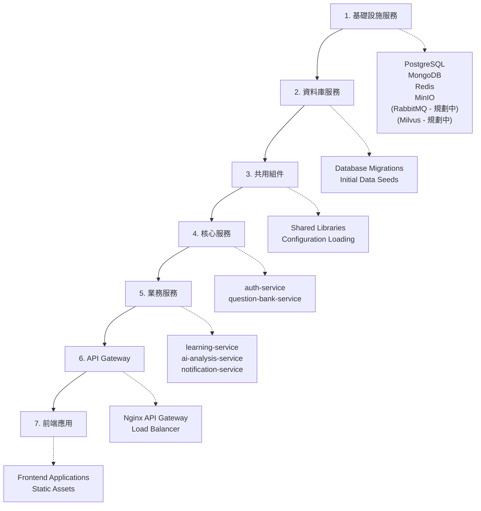

# 檔案相依關係文檔 (File Dependencies Document) - InULearning 個人化學習平台

---

**文件版本 (Document Version):** `v1.2.0`

**最後更新 (Last Updated):** `2025-08-21`

**主要作者 (Lead Author):** `AIPE01_group2`

**審核者 (Reviewers):** `AIPE01_group2 團隊成員、系統架構師`

**狀態 (Status):** `已實現 (Implemented)`

**相關設計文檔 (Related Documents):**
*   系統架構文檔: `02_system_architecture_document.md`
*   系統設計文檔: `03_system_design_document.md`
*   API 設計文檔: `04_api_design.md`
*   專案結構文檔: `07_project_structure.md`

---

## 目錄 (Table of Contents)

1.  [概述 (Overview)](#1-概述-overview)
2.  [整體架構依賴關係 (Overall Architecture Dependencies)](#2-整體架構依賴關係-overall-architecture-dependencies)
3.  [層級結構分析 (Layer Structure Analysis)](#3-層級結構分析-layer-structure-analysis)
4.  [具體 Import 關係 (Specific Import Relationships)](#4-具體-import-關係-specific-import-relationships)
5.  [循環依賴檢查 (Circular Dependency Check)](#5-循環依賴檢查-circular-dependency-check)
6.  [部署依賴順序 (Deployment Dependency Order)](#6-部署依賴順序-deployment-dependency-order)
7.  [開發依賴影響 (Development Dependency Impact)](#7-開發依賴影響-development-dependency-impact)

---

## 1. 概述 (Overview)

### 1.1 文檔目的 (Document Purpose)
*   描述 InULearning 個人化學習平台中檔案之間的相依關係，包括微服務模組導入、前後端組件依賴、AI 服務整合和層級結構，為開發團隊提供清晰的依賴關係指引。

### 1.2 依賴分析範圍 (Dependency Analysis Scope)
*   **分析層級**: 服務級、模組級、檔案級
*   **包含範圍**: 微服務內部依賴、服務間 API 依賴、前端組件依賴、AI 框架依賴、資料庫連接依賴
*   **排除項目**: 標準 Python 庫、第三方套件內部依賴、開發工具依賴

---

## 2. 整體架構依賴關係 (Overall Architecture Dependencies)

### 2.1 高層級依賴圖 (High-Level Dependency Diagram)

```mermaid
graph TD
    %% 外部依賴層
    FastAPI["FastAPI Framework"]
    PostgreSQL["PostgreSQL"]
    MongoDB["MongoDB"]
    Redis["Redis"]
    MinIO["MinIO Object Storage"]
    Gemini["Google Gemini API"]
    Nginx["Nginx API Gateway"]
    
    %% 共用組件層
    SharedDB["shared/database/"]
    SharedSchemas["shared/schemas/"]
    SharedUtils["shared/utils/"]
    SharedMiddleware["shared/middleware/"]
    
    %% 核心服務層
    AuthService["auth-service/"]
    LearningService["learning-service/"]
    QuestionBankService["question-bank-service/"]
    AIAnalysisService["ai-analysis-service/"]
    ParentDashboardService("parent-dashboard-service/")
    TeacherManagementService("teacher-management-service/")
    NotificationService("notification-service/")
    ReportService("report-service/")
    
    %% AI 核心層
    CrewAI["CrewAI Agents"]
    LangChain["LangChain Framework"]
    Milvus("Milvus Vector DB")
    
    %% 前端應用層
    StudentApp["student-app/"]
    ParentApp["parent-app/"]
    TeacherApp["teacher-app/"]
    AdminApp["admin-app/"]
    
    %% API Gateway 依賴
    Nginx --> AuthService
    Nginx --> LearningService
    Nginx --> QuestionBankService
    Nginx --> AIAnalysisService
    Nginx --> ParentDashboardService
    
    %% 服務對共用組件的依賴
    AuthService --> SharedDB & SharedSchemas & SharedUtils
    LearningService --> SharedDB & SharedSchemas & SharedUtils
    QuestionBankService --> SharedDB & SharedSchemas
    AIAnalysisService --> SharedSchemas & SharedUtils
    
    %% 服務對外部依賴
    AuthService --> PostgreSQL & Redis
    LearningService --> PostgreSQL & MongoDB & Redis
    QuestionBankService --> MongoDB & MinIO
    AIAnalysisService --> PostgreSQL & Redis & Gemini
    
    %% AI 服務內部依賴
    %% AI 服務內部依賴（現況）
    AIAnalysisService --> Redis
    AIAnalysisService --> Gemini
    %% 規劃中
    AIAnalysisService -.-> CrewAI
    AIAnalysisService -.-> LangChain
    
    %% 服務間依賴
    LearningService -.->|API Call| QuestionBankService
    LearningService -.->|API Call| AIAnalysisService
    ParentDashboardService -.->|API Call| LearningService
    ParentDashboardService -.->|API Call| AIAnalysisService
    TeacherManagementService -.->|API Call| LearningService
    ReportService -.->|API Call| LearningService
    NotificationService -.->|Event Subscribe| LearningService
    
    %% 前端對 API Gateway 的依賴
    StudentApp & ParentApp & TeacherApp & AdminApp -.->|HTTP Request| Nginx
    
    %% 樣式分類
    classDef external fill:#e1f5fe,stroke:#0277bd
    classDef shared fill:#fff3e0,stroke:#f57c00
    classDef service fill:#f3e5f5,stroke:#7b1fa2
    classDef ai fill:#e8f5e8,stroke:#388e3c
    classDef frontend fill:#e3f2fd,stroke:#1976d2
    classDef gateway fill:#fff8e1,stroke:#f9a825
    
    class FastAPI,PostgreSQL,MongoDB,Redis,MinIO,Gemini external
    class SharedDB,SharedSchemas,SharedUtils,SharedMiddleware shared
    class AuthService,LearningService,QuestionBankService service
    class ParentDashboardService,TeacherManagementService,NotificationService,ReportService service
    class AIAnalysisService,CrewAI,LangChain ai
    class Milvus ai
    class StudentApp,ParentApp,TeacherApp,AdminApp frontend
    class Nginx gateway
```


> **圖例:** `[...]` 方形邊框代表 **已實現** 的組件，`(...)` 圓角邊框代表 **規劃中** 的組件。

### 2.2 外部依賴清單 (External Dependencies List)

| 外部依賴 | 版本要求 | 用途說明 |
|----------|----------|----------|
| `fastapi` | `>=0.104.1` | 高效能 Web 框架，所有後端服務的基礎 |
| `sqlalchemy` | `>=2.0.23` | ORM 框架，PostgreSQL 資料庫操作 |
| `psycopg2-binary` | `>=2.9.9` | PostgreSQL 適配器 |
| `pymongo` | `>=4.6.0` | MongoDB 驅動程式 |
| `redis` | `>=5.0.1` | Redis 客戶端，快取和會話管理 |
| `minio` | `>=7.2.0` | MinIO 對象儲存客戶端，多媒體檔案管理 |
| `langchain` | `>=0.1.0` | LLM 應用框架，AI 服務核心 |
| `crewai` | `>=0.1.0` | AI Agent 協作框架 |
| `google-generativeai` | `>=0.3.2` | Google Gemini API 客戶端 |
| `pymilvus` | `>=2.3.4` | Milvus 向量資料庫客戶端 |
| `celery` | `>=5.3.4` | 分散式任務佇列 |
| `pydantic` | `>=2.5.0` | 資料驗證和序列化 |

---

## 3. 層級結構分析 (Layer Structure Analysis)

### 3.1 層級架構說明 (Layer Architecture Description)

#### **Layer 0: 外部依賴層 (External Dependencies Layer)**
*   **FastAPI**: 所有微服務的 Web 框架基礎
*   **PostgreSQL**: 使用者資料、學習記錄的主要資料庫
*   **MongoDB**: 題庫資料、非結構化內容儲存
*   **Redis**: 快取、會話管理、分散式鎖
*   **MinIO**: 對象儲存服務，存儲題目多媒體資源、用戶上傳檔案
*   **Google Gemini**: AI 模型推理服務
*   **Milvus**: 向量資料庫，支援 RAG 系統 (規劃中)

#### **Layer 1: 基礎設施層 (Infrastructure Layer)**
*   **API Gateway (Nginx)**: 統一入口點，路由分發
*   **Task Queue (Redis + RQ)**: AI 分析任務佇列與狀態查詢（現況）
*   **Message Queue (RabbitMQ)**: 異步通信和事件處理（規劃中）
*   **Task Queue (Celery)**: 分散式任務處理（規劃中）

#### **Layer 2: 共用組件層 (Shared Components Layer)**
*   **shared/database**: 資料庫連接和設定管理
*   **shared/schemas**: Pydantic 資料模型定義
*   **shared/utils**: 共用工具函數和助手類別
*   **shared/middleware**: 跨服務的中介軟體

#### **Layer 3: 核心服務層 (Core Services Layer)**
*   **auth-service**: 使用者認證和授權管理
*   **learning-service**: 學習歷程和練習管理
*   **question-bank-service**: 題庫管理和題目分發
*   **ai-analysis-service**: AI 驅動的學習分析

#### **Layer 4: 業務服務層 (Business Services Layer)**
*   **parent-dashboard-service**: 家長監控和報告（已實現）
*   **teacher-management-service**: 教師管理和班級分析 (規劃中)
*   **notification-service**: 通知和提醒服務 (規劃中)
*   **report-service**: 報表生成和統計分析 (規劃中)

#### **Layer 5: AI 核心層 (AI Core Layer)**
*   **Gemini**: 當前主力模型（AI 分析）
*   **CrewAI Agents**: 多 Agent 協作系統（規劃中）
*   **LangChain**: LLM 鏈式處理框架（規劃中）
*   **Vector Processing**: 向量化和相似性搜索（規劃中）

#### **Layer 6: 前端應用層 (Frontend Applications Layer)**
*   **student-app**: 學生學習介面
*   **parent-app**: 家長監控介面
*   **teacher-app**: 教師管理介面
*   **admin-app**: 系統管理介面

---

## 4. 具體 Import 關係 (Specific Import Relationships)

### 4.1 學習服務 (Learning Service) Import 關係

#### `backend/learning-service/src/main.py`
```python
# 外部框架依賴
from fastapi import FastAPI, HTTPException, Depends        # ← Web 框架
from sqlalchemy.orm import Session                         # ← ORM 會話
import redis                                               # ← 快取客戶端

# 共用組件依賴
from shared.database.connection import get_db              # ← 資料庫連接
from shared.middleware.auth import verify_token            # ← 認證中介軟體
from shared.schemas.user import UserSchema                 # ← 使用者資料模型
from shared.utils.response import APIResponse              # ← 統一回應格式

# 內部模組依賴
from .routers import exercises, sessions, recommendations  # ← API 路由
from .services.exercise_service import ExerciseService    # ← 業務邏輯服務
from .models.learning_session import LearningSession      # ← 資料模型
```

#### `backend/learning-service/src/services/exercise_service.py`
```python
# 標準庫
from typing import List, Optional                          # ← 型別標註
import logging                                             # ← 日誌記錄

# 外部套件
from sqlalchemy.orm import Session                         # ← ORM
import httpx                                               # ← HTTP 客戶端

# 共用組件
from shared.schemas.exercise import ExerciseCreateSchema   # ← 練習資料模型
from shared.utils.exceptions import BusinessException     # ← 自定義異常

# 內部依賴
from ..models.learning_session import LearningSession     # ← 資料模型
from ..models.learning_record import LearningRecord       # ← 學習記錄模型
```

### 4.2 AI 分析服務 (AI Analysis Service) Import 關係

#### `backend/ai-analysis-service/src/services/start_ai_service.py`
```python
from fastapi import FastAPI, HTTPException                 # ← Web 框架
import google.generativeai as genai                        # ← Gemini API
import psycopg2, redis, rq                                # ← PostgreSQL/Redis/RQ

# 服務內部：Redis 快取鍵、速率限制、去重鎖與批量狀態查詢等工具
from . import (get_db_connection, get_redis_client, queue_analysis_if_needed)
```

#### `backend/ai-analysis-service/src/ai_agents/analyst_agent.py`
```python
# AI 框架依賴
from crewai import Agent                                  # ← CrewAI Agent 基類
from langchain.tools import Tool                         # ← LangChain 工具
from langchain.prompts import PromptTemplate             # ← 提示模板

# 服務依賴
from ..services.gemini_service import GeminiService      # ← Gemini 服務
from ..services.langchain_service import LangChainService # ← LangChain 服務
from shared.schemas.learning import LearningRecordSchema # ← 學習記錄模型
```

### 4.3 題庫管理服務 (Question Bank Service) Import 關係

#### `backend/question-bank-service/src/main.py`
```python
# 外部框架依賴
from fastapi import FastAPI, HTTPException, Depends, UploadFile, File  # ← Web 框架
from pymongo import MongoClient                           # ← MongoDB 客戶端
from minio import Minio                                   # ← MinIO 對象儲存客戶端

# 共用組件依賴
from shared.database.mongodb import get_mongo_db          # ← MongoDB 連接
from shared.middleware.auth import verify_token           # ← 認證中介軟體
from shared.schemas.question import QuestionSchema        # ← 題目資料模型
from shared.utils.response import APIResponse             # ← 統一回應格式

# 內部模組依賴
from .routers import questions, files                     # ← API 路由
from .services.question_service import QuestionService    # ← 題目業務邏輯
from .services.file_service import FileService            # ← 檔案管理服務
from .services.minio_client import MinIOClient            # ← MinIO 客戶端封裝
```

#### `backend/question-bank-service/src/services/file_service.py`
```python
# 外部依賴
from minio import Minio                                   # ← MinIO 客戶端
from minio.error import S3Error                           # ← MinIO 錯誤處理
import uuid                                               # ← UUID 生成
from datetime import datetime, timedelta                  # ← 時間處理

# 內部依賴
from .minio_client import MinIOClient                     # ← MinIO 客戶端封裝
from shared.schemas.file import FileSchema                # ← 檔案資料模型
from shared.utils.validation import validate_file_type   # ← 檔案驗證工具
```

### 4.4 前端學生應用 Import 關係

#### `frontend/student-app/js/main.js`
```javascript
// 內部模組依賴
import { ApiClient } from './api/client.js';              // ← API 客戶端
import { ExerciseComponent } from './components/exercise.js'; // ← 練習組件
import { DashboardComponent } from './components/dashboard.js'; // ← 儀表板組件
import { ResultsComponent } from './components/results.js'; // ← 結果組件
import { StateManager } from './utils/state-manager.js';  // ← 狀態管理
import { Router } from './utils/router.js';               // ← 路由管理
```

#### `frontend/student-app/js/api/client.js`
```javascript
// 內部 API 模組
import { AuthAPI } from './auth.js';                      // ← 認證 API
import { ExerciseAPI } from './exercise.js';              // ← 練習 API
import { LearningAPI } from './learning.js';              // ← 學習 API
import { config } from '../config/api-config.js';         // ← API 配置
```

---

## 5. 循環依賴檢查 (Circular Dependency Check)

### 5.1 循環依賴檢測結果 (Circular Dependency Detection Results)

#### ✅ 無循環依賴 (No Circular Dependencies)
*   所有微服務遵循**單向依賴原則**，依賴關係形成有向無環圖 (DAG)
*   服務間通信僅通過 **API 調用**，無直接模組導入
*   共用組件採用**依賴注入**模式，避免循環引用

#### 🔍 潛在風險點檢查 (Potential Risk Points Check)

1. **服務間 API 依賴**: 
   - ✅ Learning Service → Question Bank Service (單向)
   - ✅ Learning Service → AI Analysis Service (單向)
   - ✅ Parent Dashboard → Learning Service (單向)

2. **AI Agent 協作**:
   - ✅ Analyst Agent → Tutor Agent → Recommender Agent (順序協作)
   - ✅ 無相互遞迴調用

3. **前端組件**:
   - ✅ 採用事件驅動架構，組件間解耦
   - ✅ 統一狀態管理，避免雙向資料流

### 5.2 依賴隔離設計 (Dependency Isolation Design)

1. **配置隔離**: 所有配置集中在 `shared/config/` 和各服務的 `config.py`
2. **資料模型隔離**: Pydantic 模型統一在 `shared/schemas/`
3. **資料庫隔離**: 每個服務擁有獨立的資料庫連接和模型
4. **API 隔離**: 服務間僅通過 RESTful API 通信，無直接資料庫訪問
5. **前端隔離**: 各角色應用完全獨立，共用組件在 `shared/`

---

## 6. 部署依賴順序 (Deployment Dependency Order)

### 6.1 服務啟動順序 (Service Startup Order)



### 6.2 詳細啟動序列 (Detailed Startup Sequence)

1. **基礎設施服務** (Infrastructure Services)
   - PostgreSQL (使用者資料、學習記錄)
   - MongoDB (題庫資料)
   - Redis (快取、會話)
   - MinIO (對象儲存、多媒體檔案)
   - RabbitMQ (訊息佇列)
   - Milvus (向量資料庫)

2. **資料庫遷移和初始化** (Database Migration & Initialization)
   - PostgreSQL 資料表建立
   - MongoDB 索引建立
   - 種子資料載入

3. **核心服務** (Core Services)
   - `auth-service` (認證服務，其他服務依賴其進行認證)
   - `question-bank-service` (題庫服務，學習服務依賴)

4. **依賴核心服務的業務服務** (Business Services)
   - `learning-service` (依賴 auth-service 和 question-bank-service)
   - `ai-analysis-service` (依賴 PostgreSQL、Redis；供 Learning/Parent Dashboard 調用)

5. **高階業務服務** (Advanced Business Services)
   - `parent-dashboard-service` (依賴 learning-service、ai-analysis-service)
   - `teacher-management-service` (依賴 learning-service)
   - `report-service` (依賴多個服務的資料)
   - `notification-service` (事件訂閱者)

6. **API Gateway** (統一入口點)
   - Nginx 配置和啟動

7. **前端應用** (Frontend Applications)
   - 靜態檔案部署
   - CDN 配置

---

## 7. 開發依賴影響 (Development Dependency Impact)

### 7.1 修改影響範圍分析 (Change Impact Analysis)

| 修改檔案/模組 | 直接影響 | 間接影響 | 重新測試範圍 |
|---------------|----------|----------|--------------|
| `shared/schemas/user.py` | 所有使用 UserSchema 的服務 | 前端 API 調用邏輯 | 使用者相關的所有端點測試 |
| `auth-service/` | 所有需要認證的服務 | 前端登入狀態管理 | 全系統整合測試 |
| `learning-service/models/` | learning-service 內部 | ai-analysis-service API 調用 | 學習相關功能測試 |
| `ai-analysis-service/agents/` | AI 分析功能 | 學習建議和弱點分析 | AI 模型準確性測試 |
| `frontend/shared/components/` | 所有前端應用 | 使用者介面一致性 | UI/UX 回歸測試 |

### 7.2 關鍵依賴風險評估 (Critical Dependency Risk Assessment)

#### 🔴 高風險依賴 (High-Risk Dependencies)
1. **Google Gemini API**: 外部 AI 服務，可能影響 AI 分析功能
   - **緩解策略**: 實作本地模型備援方案
   - **監控**: API 可用性和響應時間監控

2. **PostgreSQL 主資料庫**: 核心資料儲存
   - **緩解策略**: 主從備份、讀寫分離
   - **監控**: 資料庫連接數、查詢效能

#### 🟡 中等風險依賴 (Medium-Risk Dependencies)
1. **Redis 快取層**: 效能優化關鍵
   - **緩解策略**: 快取失效時直接查詢資料庫
   - **監控**: 快取命中率、記憶體使用率

2. **MongoDB 題庫**: 題目資料儲存
   - **緩解策略**: 定期備份、副本集配置
   - **監控**: 查詢效能、儲存空間

#### 🟢 低風險依賴 (Low-Risk Dependencies)
1. **前端靜態資源**: 可快速重新部署
2. **通知服務**: 非關鍵路徑功能
3. **報表服務**: 可延遲處理

### 7.3 開發工作流程建議 (Development Workflow Recommendations)

#### 依賴更新策略 (Dependency Update Strategy)
1. **共用組件優先**: 先更新 `shared/` 下的組件，確保向下相容
2. **核心服務穩定**: `auth-service` 和 `learning-service` 變更需要額外測試
3. **AI 模組獨立**: AI 相關更新可以獨立進行，不影響核心功能
4. **前端漸進式**: 前端應用可以逐步更新，互不影響

#### 測試依賴策略 (Testing Dependency Strategy)
1. **單元測試**: 每個模組獨立測試，Mock 外部依賴
2. **整合測試**: 服務間 API 契約測試
3. **端對端測試**: 完整使用者流程測試
4. **AI 模型測試**: 獨立的 AI 準確性和效能測試

---

## 📝 使用指南 (Usage Guide)

### 如何使用此文檔 (How to Use This Document)
1. **開發前檢查**: 在開始新功能開發前，檢查相關依賴關係
2. **修改評估**: 修改任何組件前，先評估影響範圍
3. **部署參考**: 按照依賴順序進行服務部署
4. **除錯協助**: 出現問題時，依據依賴關係分析根因

### 維護建議 (Maintenance Recommendations)
*   **定期更新**: 隨著專案演進，及時更新依賴關係圖
*   **依賴審查**: 每月檢查是否引入了新的循環依賴
*   **效能監控**: 關注關鍵依賴的效能指標
*   **風險評估**: 定期評估外部依賴的可用性風險

---

**文件審核記錄 (Review History):**

| 日期 | 審核人 | 版本 | 變更摘要/主要反饋 |
| :--------- | :--------- | :--- | :---------------------------------------------- |
| 2024-12-19 | AIPE01_group2 | v1.0.0 | 初稿完成，整合系統架構和設計文檔建立完整檔案相依關係分析 |
| 2024-07-26 | AIPE01_group2 | v1.1.0 | 根據 v1.0 實際專案結構更新依賴關係圖和部署順序，標示規劃中組件，並將文件狀態更新為「已實現」。 | 