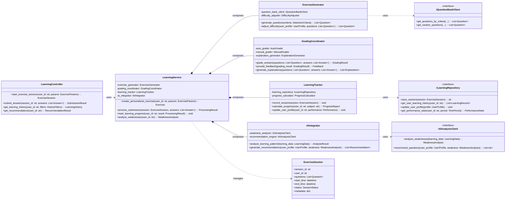

# 類別/組件關係文檔 (Class/Component Relationships Document) - InULearning 學習服務模組

---

**文件版本 (Document Version):** `v1.1`

**最後更新 (Last Updated):** `2025-08-21`

**主要作者 (Lead Author):** `AIPE01_group2`

**審核者 (Reviewers):** `AIPE01_group2 團隊成員`

**狀態 (Status):** `已批准 (Approved)`

**相關設計文檔 (Related Design Documents):**
*   系統架構文檔 (SA): `02_system_architecture_document.md`
*   系統詳細設計文檔 (SD): `03_system_design_document.md`

---

## 目錄 (Table of Contents)

1.  [概述 (Overview)](#1-概述-overview)
2.  [核心類別圖 (Core Class Diagram)](#2-核心類別圖-core-class-diagram)
3.  [主要類別/組件職責 (Key Class/Component Responsibilities)](#3-主要類別組件職責-key-classcomponent-responsibilities)
4.  [關係詳解 (Relationship Details)](#4-關係詳解-relationship-details)
5.  [設計模式應用 (Design Pattern Applications)](#5-設計模式應用-design-pattern-applications)
6.  [SOLID 原則遵循情況 (SOLID Principles Adherence)](#6-solid-原則遵循情況-solid-principles-adherence)
7.  [接口契約 (Interface Contracts)](#7-接口契約-interface-contracts)
8.  [附錄 (Appendix)](#8-附錄-appendix)

---

## 1. 概述 (Overview)

### 1.1 文檔目的 (Document Purpose)
*   本文檔透過 UML 類別圖與表格，呈現 InULearning 學習服務模組的核心類別、組件與接口的靜態結構關係。
*   作為開發與維運團隊理解後端學習模組設計、維護代碼庫結構與進行重構時的依據，確保遵循良好的物件導向與分層原則。

### 1.2 建模範圍 (Modeling Scope)
*   **包含範圍**: 核心業務類別（`LearningService` 等）、控制器、資料存取介面（`ILearningRepository`）、外部服務客戶端介面（`IQuestionBankClient`, `IAIAnalysisClient`）、主要資料模型（`ExerciseSession` 等）。
*   **排除範圍**: 前端 UI、第三方套件內部類別、測試專用類別、生成代碼。
*   **抽象層級**: 聚焦公開屬性與方法簽名，忽略實作細節；以接口驅動的依賴關係為主。

### 1.3 UML 符號說明 (UML Notation Conventions)
*   **繼承 (Inheritance):** `--|>` (is-a) - 子類別繼承父類別。
*   **實現 (Implementation):** `..|>` (implements) - 類別實現接口。
*   **組合 (Composition):** `*--` (has-a, strong ownership) - 組件的生命週期依賴於容器。
*   **聚合 (Aggregation):** `o--` (has-a, weak ownership) - 組件的生命週期獨立於容器。
*   **依賴 (Dependency):** `..>` (uses-a) - 一個類別的方法使用了另一個類別。
*   **關聯 (Association):** `-->` (has-a) - 類別之間的一般關係。

---

## 2. 核心類別圖 (Core Class Diagram)

*   **圖表說明:** 學習模組以 `LearningService` 為核心，透過組合（Composition）協調題目生成、批改、學習追蹤與 AI 整合；所有外部依賴（資料庫、題庫服務、AI 分析服務）均以接口抽象注入，遵循依賴反轉原則，提升可測試性與可替換性。

---

## 3. 主要類別/組件職責 (Key Class/Component Responsibilities)

| 類別/組件 (Class/Component) | 核心職責 (Core Responsibility) | 主要協作者 (Key Collaborators) | 所屬模組 |
| :-- | :-- | :-- | :-- |
| `LearningController` | 對外 HTTP 端點控制器；負責驗證、參數綁定與調用服務層 | `LearningService` | `controllers` |
| `LearningService` | 協調題目生成、批改、追蹤與 AI 分析的核心服務 | `ExerciseGenerator`, `GradingCoordinator`, `LearningTracker`, `AIIntegrator` | `services` |
| `ExerciseGenerator` | 依條件產生個人化題目並做難度調整 | `IQuestionBankClient` | `services/generation` |
| `GradingCoordinator` | 統一批改流程與詳解產生（不分對錯皆產生詳解） | `AutoGrader`, `ExplanationGenerator` | `services/grading` |
| `LearningTracker` | 紀錄會話與更新用戶學習檔案/進度 | `ILearningRepository` | `services/tracking` |
| `AIIntegrator` | 串接 AI 分析服務進行弱點分析與推薦 | `IAIAnalysisClient` | `services/ai` |
| `ILearningRepository` (Interface) | 定義學習資料持久化與查詢契約 | PostgreSQL | `repositories` |
| `IQuestionBankClient` (Interface) | 題庫服務客戶端抽象 | 題庫微服務 (MongoDB/MinIO) | `clients` |
| `IAIAnalysisClient` (Interface) | AI 分析服務客戶端抽象 | AI 分析微服務（內部以 Redis+RQ 執行任務） | `clients` |
| `ExerciseSession` | 練習會話聚合根，維護題目與狀態 | `LearningService` | `models` |

---

## 4. 關係詳解 (Relationship Details)

### 4.1 繼承/實現 (Inheritance/Implementation)
*   **`ILearningRepository`（interface） → 多種資料庫實作（未列於本圖）**：以接口隔離資料層，允許替換不同儲存後端。
*   **`IQuestionBankClient`（interface）**：屏蔽題庫微服務的細節，便於切換協議或調整 API。
*   **`IAIAnalysisClient`（interface）**：抽象 AI 分析端點（包括非同步/查詢模式），符合開放封閉原則。

### 4.2 組合/聚合 (Composition/Aggregation)
*   `LearningService` 對 `ExerciseGenerator`、`GradingCoordinator`、`LearningTracker`、`AIIntegrator` 採用組合（Composition），強生命週期關係，確保核心流程內聚。
*   `LearningTracker` 聚合 `ILearningRepository` 以實現持久化與查詢，保持服務層無狀態。

### 4.3 依賴 (Dependency)
*   `ExerciseGenerator` 依賴 `IQuestionBankClient` 取得題目；`AIIntegrator` 依賴 `IAIAnalysisClient` 觸發/查詢 AI 分析結果。
*   `LearningController` 依賴 `LearningService` 完成應用用例；`LearningService` 依賴 `ExerciseSession` 作為會話聚合根管理學習流程狀態。

---

## 5. 設計模式應用 (Design Pattern Applications)

| 設計模式 (Design Pattern) | 應用場景/涉及類別 | 設計目的/解決的問題 |
| :-- | :-- | :-- |
| 策略模式 (Strategy) | `LearningService` 透過 `ILearningRepository`、`IQuestionBankClient`、`IAIAnalysisClient` | 將外部依賴與儲存細節抽象化，便於切換實作與測試替身 |
| 外觀模式 (Facade) | `LearningService` 協調 `ExerciseGenerator`、`GradingCoordinator`、`LearningTracker`、`AIIntegrator` | 對外提供統一用例接口，封裝複雜協作流程 |
| 適配器 (Adapter) | 具體的題庫/AI 客戶端實作 ↔ 介面 | 適配外部微服務 API 變動，降低變更衝擊 |
| 依賴注入 (DI) | 控制器與服務、服務與介面 | 降低耦合、提升可測試性，允許注入 Mock/Stubs |
| 值物件/聚合根 (DDD) | `ExerciseSession` | 穩定內部不變式，聚合會話內資料的一致性 |

---

## 6. SOLID 原則遵循情況 (SOLID Principles Adherence)

*   [x] **S - 單一職責原則:** 控制器處理交互，服務協調業務，Repository 專注持久化，客戶端專注外部 API。
*   [x] **O - 開放/封閉原則:** 以接口抽象外部依賴與儲存，新增實作無需修改服務層。
*   [x] **L - 里氏替換原則:** 所有 `I*` 介面實作可互換，不破壞呼叫端假設。
*   [x] **I - 介面隔離原則:** 依據用例拆分為精簡的 `ILearningRepository`、`IQuestionBankClient`、`IAIAnalysisClient`。
*   [x] **D - 依賴反轉原則:** 高層模組依賴介面抽象，透過 DI 注入具體實作或測試替身。

---

## 7. 接口契約 (Interface Contracts)

### 7.1 `ILearningRepository`
*   **目的:** 定義學習資料的持久化與查詢操作，支援會話、記錄、用戶檔案與分析歷史。
*   **方法 (Methods):**
    *   `save_session(session: ExerciseSession) -> str`
        *   描述: 建立或更新學習會話；回傳會話 ID。
    *   `get_user_learning_history(user_id: str) -> List[LearningRecord]`
        *   描述: 查詢用戶學習記錄（可套用分頁/期間）。
    *   `update_user_profile(profile: UserProfile) -> None`
        *   描述: 更新或插入用戶學習檔案。
    *   `get_performance_stats(user_id: str, period: TimePeriod) -> PerformanceStats`
        *   描述: 彙整期間內的成績/正確率統計。

### 7.2 `IQuestionBankClient`
*   **目的:** 抽象題庫微服務 API；支援條件檢索與隨機取題。
*   **方法 (Methods):**
    *   `get_questions_by_criteria(grade, subject, publisher, chapter=None, difficulty=None, knowledge_points=None, limit=10) -> List[Question]`
    *   `get_random_questions(grade, subject, publisher, count=10, exclude_ids=None) -> List[Question]`

### 7.3 `IAIAnalysisClient`
*   **目的:** 抽象 AI 分析微服務 API；支援觸發分析、查詢結果與推薦。
*   **方法 (Methods):**
    *   `analyze_weaknesses(learning_data: LearningData) -> WeaknessAnalysis`
    *   `recommend_questions(user_profile: UserProfile, weakness: WeaknessAnalysis) -> List[str]`
    *   （可選）`get_task_status(task_id: str) -> AnalysisStatus`（若採用非同步查詢模式）

---

## 8. 附錄 (Appendix)

*   可延伸圖表：將 `IAIAnalysisClient` 與 AI 分析微服務的非同步端點（Redis+RQ 任務）建模為序列圖，以輔助除錯與容量規劃。

---
**文件審核記錄 (Review History):**

| 日期 | 審核人 | 版本 | 變更摘要/主要反饋 |
| :--------- | :--------- | :--- | :---------------- |
| 2025-08-21 | AIPE01_group2 | v1.1 | 將模板落地為學習服務實作：核心類別圖、職責表、介面契約；對齊 `02/03` 文件與 Redis+RQ 現況 |
| 2024-12-19 | AIPE01_group2 | v1.0 | 初稿模板建立 |